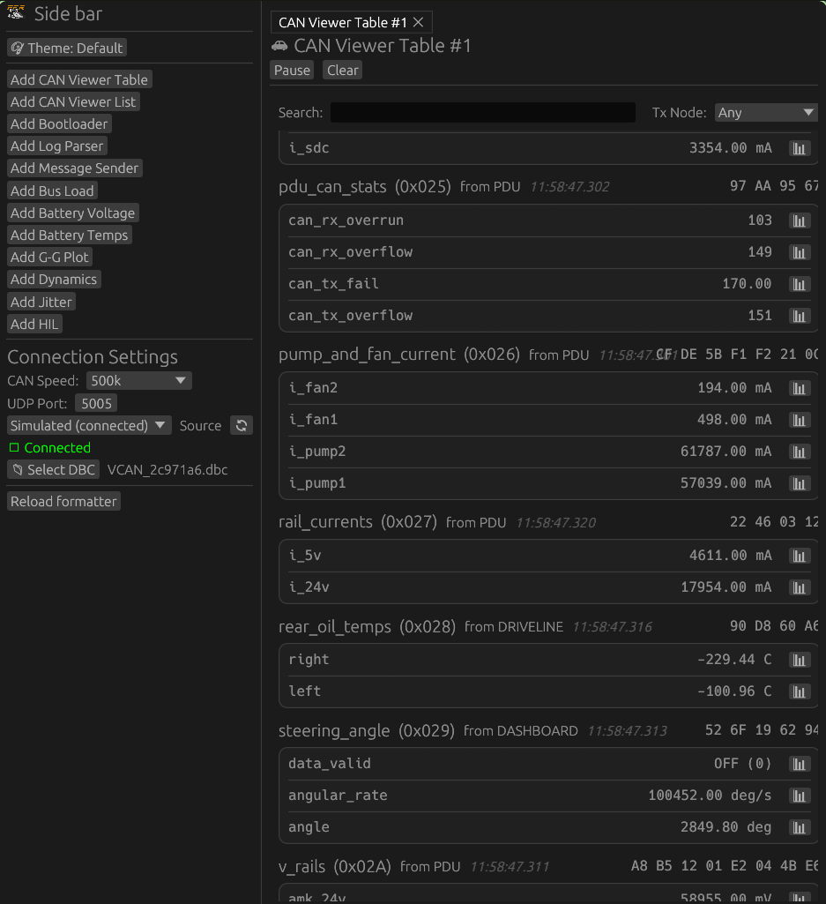
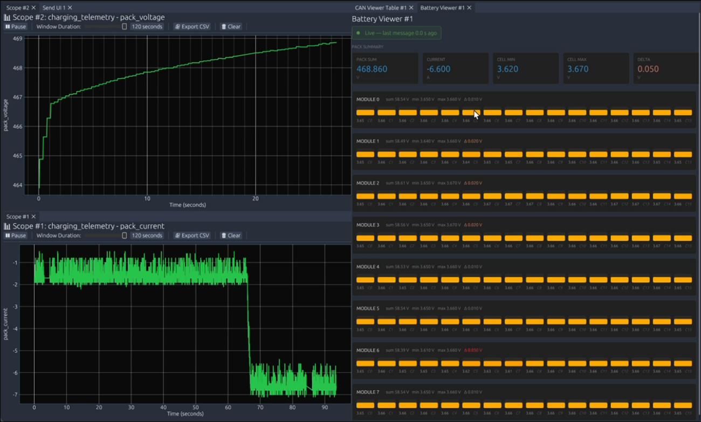
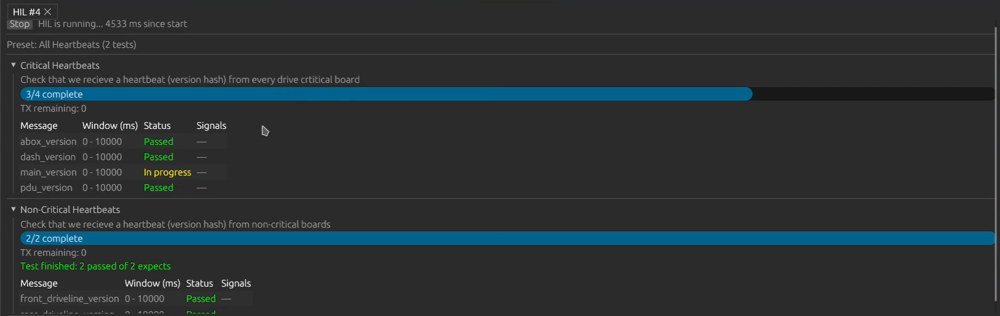
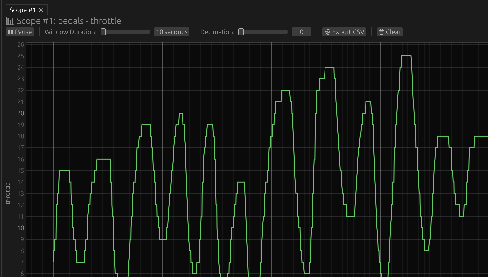
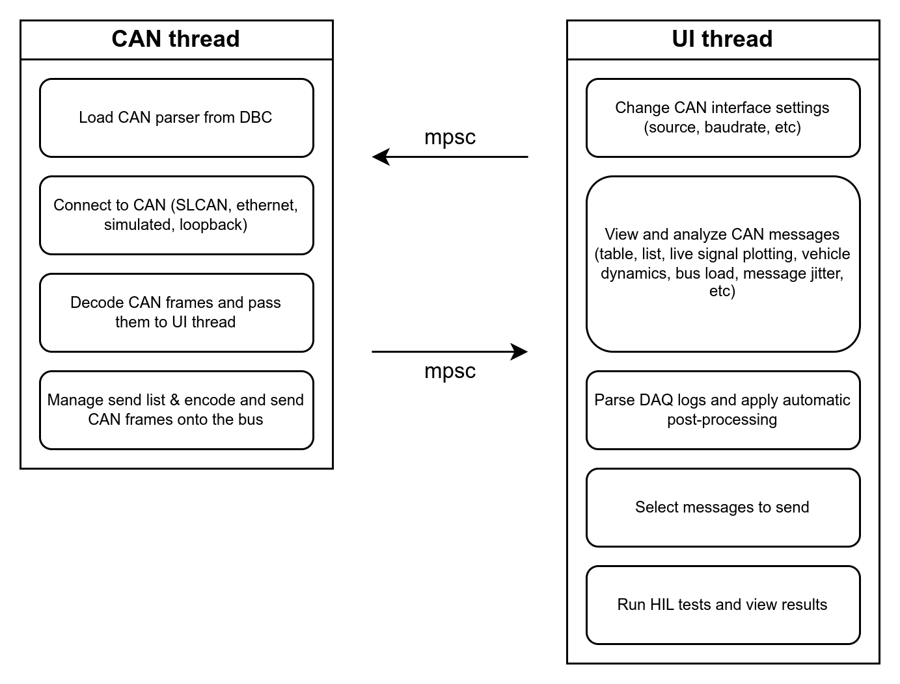
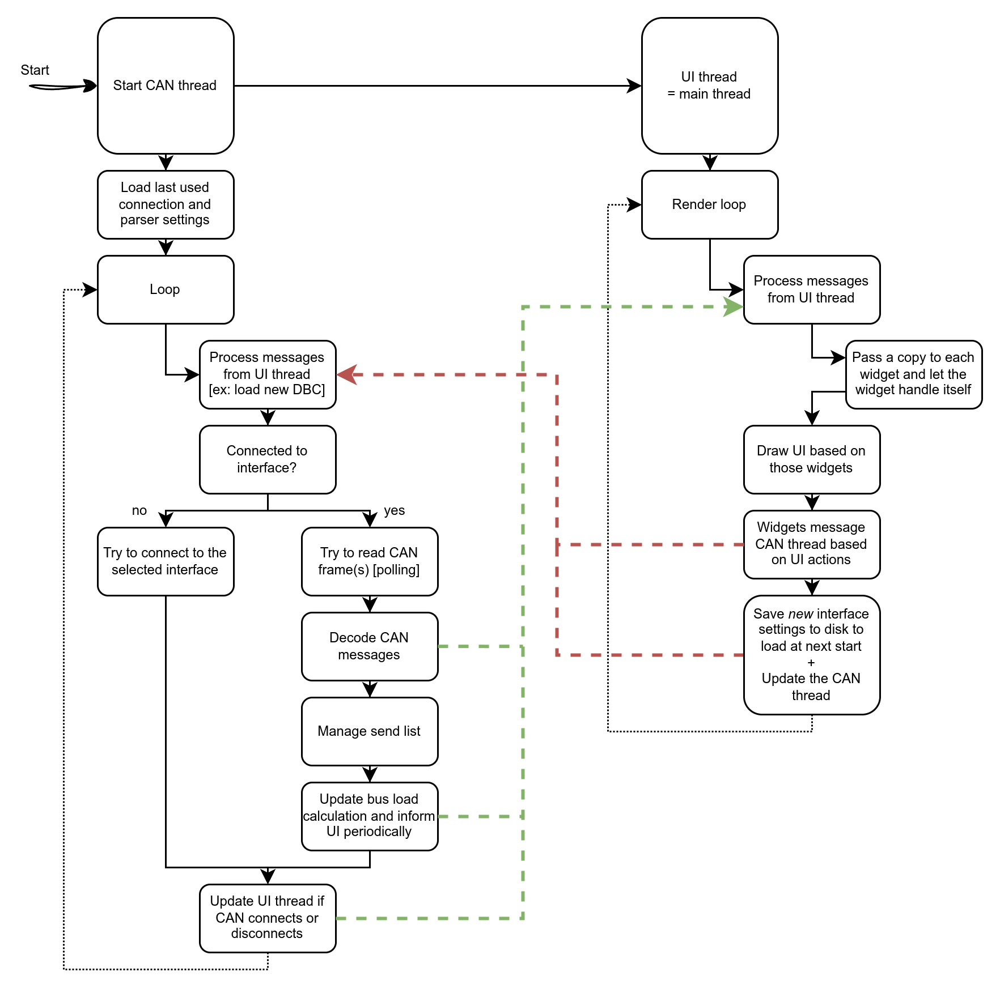

# PER DaqApp

DaqApp is PER's complete trackside data acquisition and analysis desktop application/tooling.

## What it does

- Connects to supported CAN sources and decodes traffic with a selected SuperDBC JSON database
- Displays live signals in configurable tables, lists, scopes, and dashboards
- Configurable widgets for battery data, bus load, jitter, dynamics GPS, G-G plots, and more
- Logs classic CAN data frames on bus slots 0 and 1 in the existing log format
- Run log parsing and correlation tools
- Fully support for CAN-message sending
- Hardware-in-the-loop configuration, test running, and results viewing
- Full PER Bootloader workflow

## Screenshots

<table>
  <tr>
    <td></td>
    <td></td>
  </tr>
  <tr>
    <td></td>
    <td></td>
  </tr>
</table>

## Using the app

1. Use sidebar to select a CAN source from the connection controls (SLCAN, UDP, or dev modes)
2. Use sidebar to select `superdbc_<hash>.json` and the physical bus so messages and signals can be decoded. The file picker opens in `monorepo/dbc`, which is an output from the firmware build process.
3. Use the sidebar (or ctrl-P) to launch widgets
4. Use **Bootloader** to validate and upload a package. See the
   [bootloader update guide](../../docs/daqapp/bootloader_updates.md).

Sidebar settings (source, database and bus, etc) are saved to a local settings file to persist between sessions.

## Getting started

Install Rust/Cargo and the platform prerequisites described in the repository
[setup guide](../../docs/setup.md). Linux users also likely need `libudev-dev` and
`pkg-config` to discover serial devices.

### To Build

From the repository root:

```bash
cargo build --manifest-path daq/daqapp/Cargo.toml --locked
```

From the `daq/daqapp/` directory, you can also build with Cargo directly:

```bash
cargo build --locked
```

### To Run

Starting from the repository root, run the app with:

```bash
cd daq/daqapp && cargo run
```

Running is supported only with `daq/daqapp/` as the working directory so the
app can find its themes, formatter configuration, and HIL presets. Settings and
logs are also relative to this directory.

## Development

Useful commands from `daq/daqapp/`:

```bash
cargo fmt
cargo build --locked
cargo run
```

The app's source is organized by responsibility:

- `src/can/` - CAN connection, decoding, state, and background thread.
- `src/ui/` - application views and panels.
- `../daqcore/src/log_parse/` - recorded-log parsing and correlation.
- `src/hil/` and `hil_config/` - hardware-in-the-loop support and presets.
- `themes/` - user-selectable visual themes.

### Thread overview




### Testing

For easy testing, you can use the loopback or simulated CAN sources. The loopback source is a virtual CAN bus that echoes messages sent to it, while the simulated source generates random messages for testing purposes.

Rust tests cover direct streaming, the 480 KiB boundary, the 24-bit word index,
and the READY handshake. Run them from `daq/daqapp/` with `cargo test`.

### SuperDBC decoding and log CLI

The database is generated alongside per-bus DBC files by CANpiler. On first start,
the app discovers the most recently modified `superdbc_*.json` under `dbc/`.
Existing `dbc_path` settings migrate to the JSON database. A manually configured
JSON path that fails to load is reported without silently selecting another file.
Changing the database or active bus clears signal selections/history, cancels
scheduled sends, and stops HIL tests.

The legacy 16-byte UDP/log format carries only bus slots 0/1 and eight payload
bytes, without DLC or remote-frame information. Live SLCAN frames retain their
actual DLC and remote kind; CAN FD is unsupported.

Parse recorded logs without the GUI:

```bash
cargo run --manifest-path daq/Cargo.toml -p daqcli -- \
  dbc/superdbc_<hash>.json path/to/logs path/to/csv
```

Optional arguments are output prefix, slot-0 bus name, and slot-1 bus name
(defaults: `out`, `VCAN`, `MCAN`). The GUI log parser offers the same bus bindings
and optional per-slot database overrides. Physical encoding rejects non-finite
inputs; the core also provides exact raw integer encoding for 64-bit signals.
