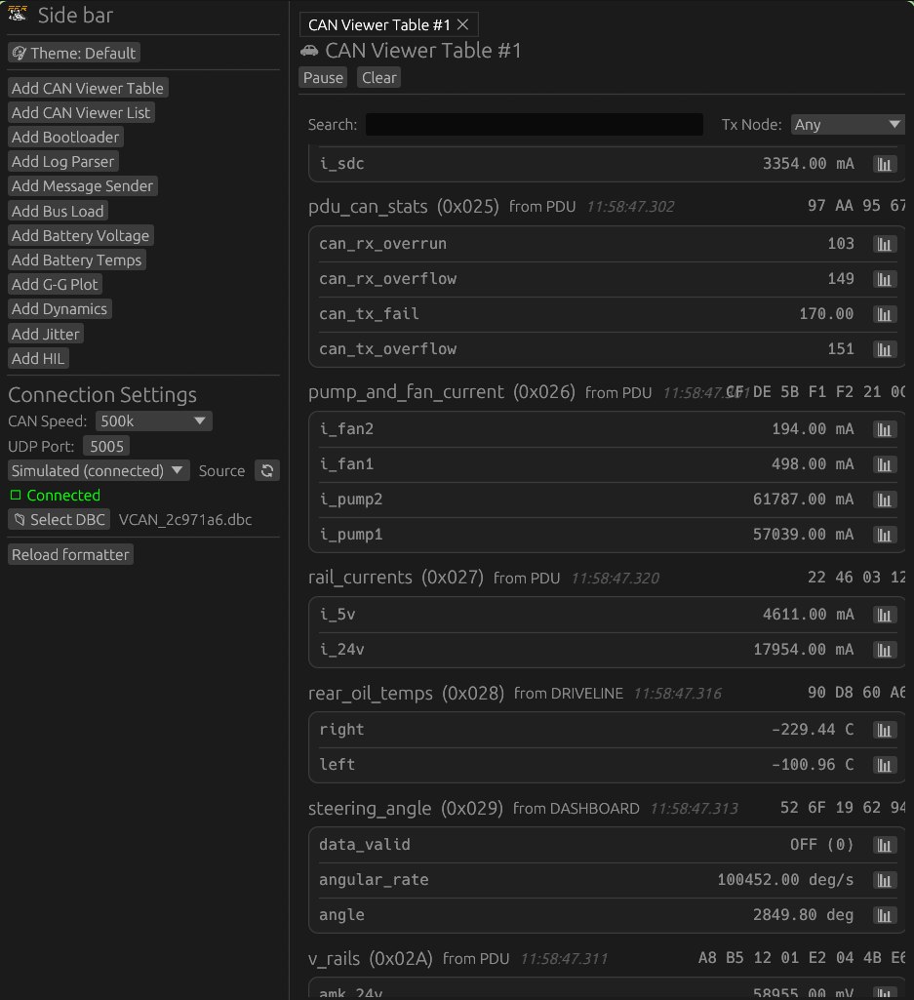
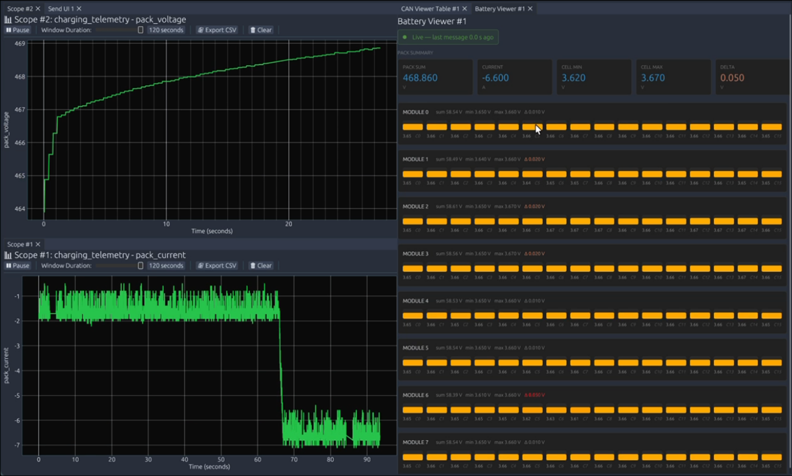
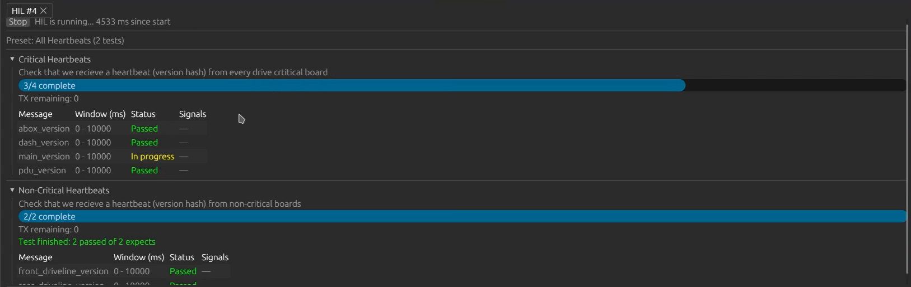
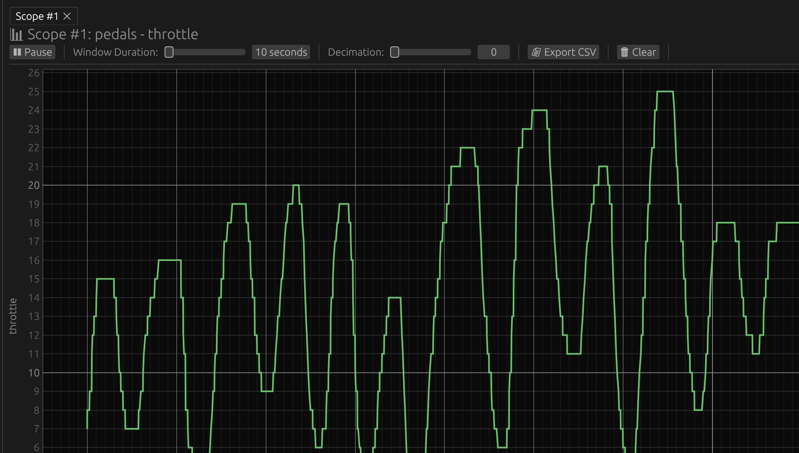
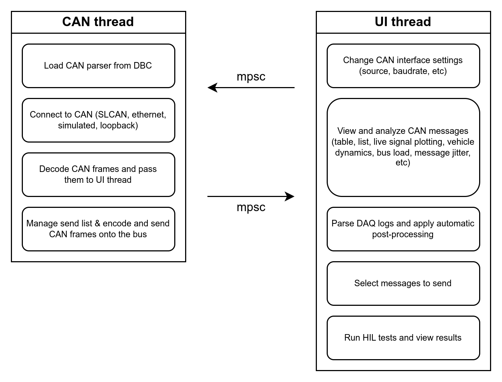
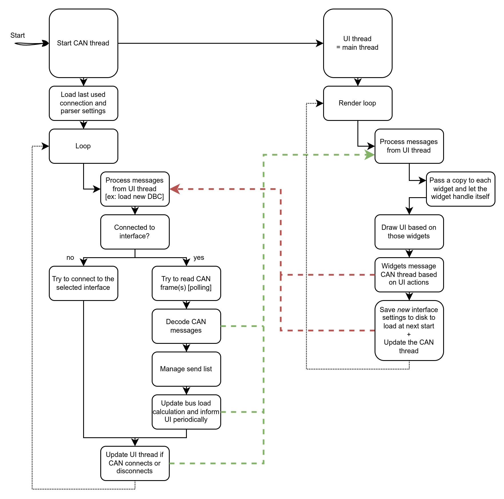

# PER DaqApp

DaqApp is PER's complete trackside data acquisition and analysis desktop application/tooling.

## What it does

- Connects to supported CAN sources and decodes traffic with a selected SuperDBC artifact and CAN bus
- Displays live signals in configurable tables, lists, scopes, and dashboards
- Configurable widgets for battery data, bus load, jitter, dynamics GPS, G-G plots, and more
- Logs all received CAN traffic
- Run log parsing and correlation tools
- Fully support for CAN-message sending
- Hardware-in-the-loop configuration, test running, and results viewing
- Full PER Bootloader workflow

## Screenshots

<table>
  <tr>
    <td></td>
    <td></td>
  </tr>
  <tr>
    <td></td>
    <td></td>
  </tr>
</table>

## Using the app

1. Use sidebar to select a CAN source from the connection controls (SLCAN, CANnector USB, UDP, or dev modes)
2. Use the sidebar to select a `superdbc_*.json` artifact and its CAN bus. The file picker opens in `monorepo/superdbc`, which is an output from the firmware build process
3. Use the sidebar (or ctrl-P) to launch widgets
4. Use **Bootloader** to validate and upload a package. See the
   [bootloader update guide](../../docs/daqapp/bootloader_updates.md).

Sidebar settings (source, SuperDBC, etc) are saved to a local settings file to persist between sessions.

## CANnector USB

The custom CANnector board uses native USB bulk transfers, not SLCAN/serial.
It appears as `CANnector27_<firmware hash>` (USB VID:PID `5045:0271`), so no
`/dev/tty.*` or COM port is expected.

1. Connect one CANnector over USB-C.
2. Under **Source → Native USB**, select the input the board is wired to:
   **VCAN input**, **MCAN input**, or **SCAN input**.
3. Select a SuperDBC and the bus describing the traffic. The physical input
   selection and the decoding bus are independent, so a board's VCAN can be
   decoded with whatever message definitions that board actually uses.

Current firmware/driver limitations:

- All inputs run at **500 kbps**, fixed in firmware. The CAN Speed dropdown
  configures serial adapters, not CANnector. Traffic on a bus running at another
  rate (250 kbps CCAN, 1 Mbps TEST_CAN in `bus_configs.json`) cannot be captured.
- Receive-only: sending messages, HIL actions requiring transmission, and
  bootloader uploads are unsupported. The app refuses a firmware update up front
  rather than failing partway through.
- Records contain eight padded payload bytes, but no original DLC/RTR/FD flags.
  Frames are displayed as classic data frames with DLC 8. SuperDBC decoding
  ignores padding. The app uses host receive timestamps, not board timestamps.
- The driver rejects multiple connected CANnectors rather than selecting one
  arbitrarily. The USB protocol has no per-device serial number.
- Bus load is estimated from those padded eight-byte payloads, so it reads high
  for traffic with short frames.

The driver uses vendored libusb. macOS needs no serial driver. Linux may need
a udev permission rule for `idVendor=5045`, `idProduct=0271`; Windows needs
WinUSB bound to this device's interface (not the Nucleo/ST-LINK).

A bounded receive-only check, independent of DAQApp and its DBC, can be run from
the repository root while DAQApp is not using the CANnector:

```bash
cargo run --manifest-path daq/daqcore/Cargo.toml --example cannector_probe -- vcan 5
```

## Getting started

Install Rust/Cargo and the platform prerequisites described in the repository
[setup guide](../../docs/setup.md). Linux users also likely need `libudev-dev` and
`pkg-config` to discover serial devices.

### To Build

From the repository root:

```bash
cargo build --manifest-path daq/daqapp/Cargo.toml --locked
```

From the `daq/daqapp/` directory, you can also build with Cargo directly:

```bash
cargo build --locked
```

### To Run

Starting from the repository root, run the app with:

```bash
cd daq/daqapp && cargo run
```

Running is supported only with `daq/daqapp/` as the working directory so the
app can find its themes, formatter configuration, and HIL presets. Settings and
logs are also relative to this directory.

## Development

Useful commands from `daq/daqapp/`:

```bash
cargo fmt
cargo build --locked
cargo run
```

The app's source is organized by responsibility:

- `src/ui/` - application views and panels.
- `../daqcore/src/can_thread/` - CAN worker and operational commands/events.
- `../daqcore/src/superdbc/` - bus-aware definitions, decoding, and encoding.
- `../daqcore/src/log_parse/` - recorded-log parsing and correlation.
- `../daqcore/src/hil/` and `hil_config/` - HIL support and presets
- `themes/` - user-selectable visual themes.

### Thread overview




### Testing

For easy testing, you can use the loopback or simulated CAN sources. The loopback source is a virtual CAN bus that echoes messages sent to it, while the simulated source generates random messages for testing purposes.
