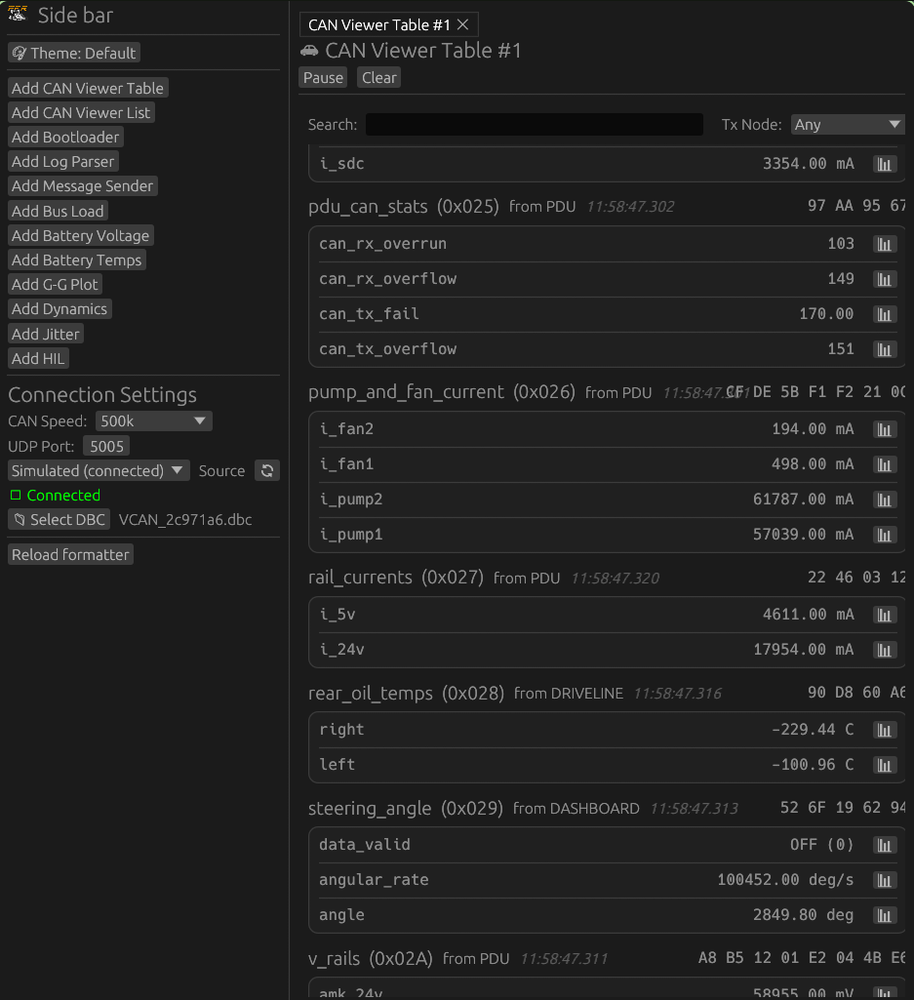
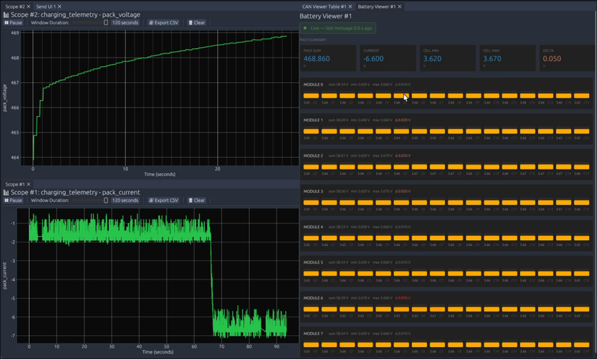
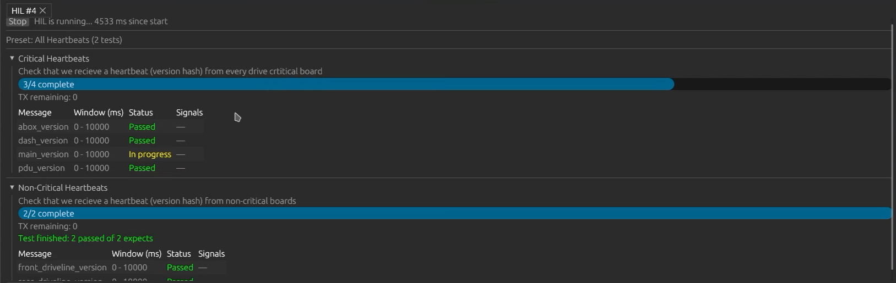
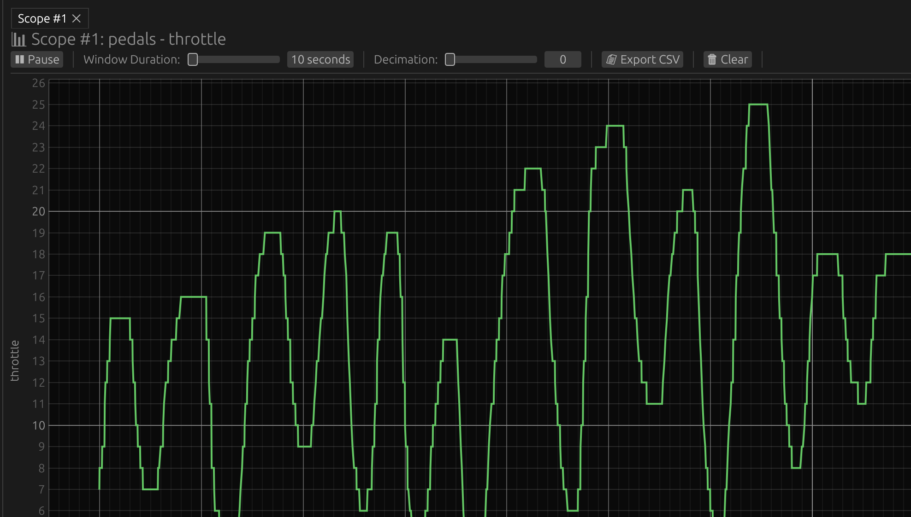
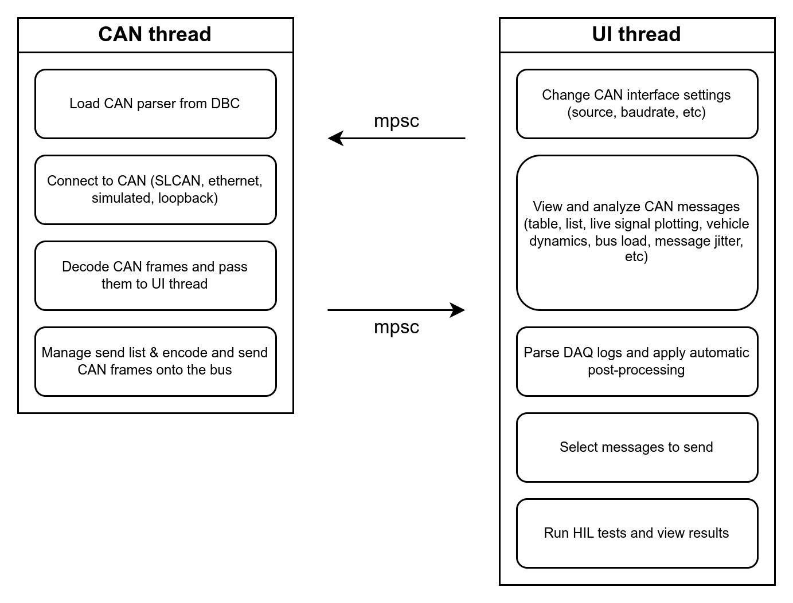
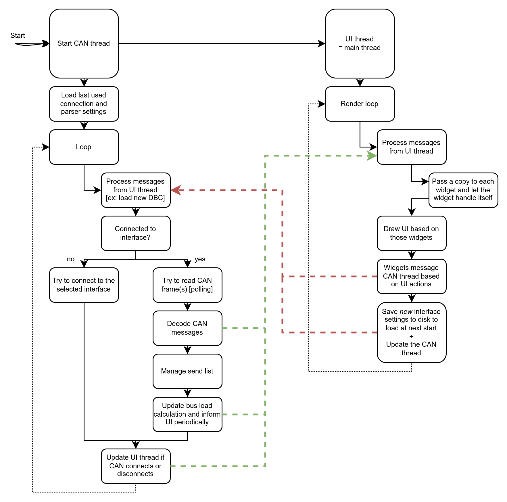

# PER DaqApp

DaqApp is PER's complete trackside data acquisition and analysis desktop application/tooling.

## What it does

- Connects to supported CAN sources and decodes traffic with a selected DBC
- Displays live signals in configurable tables, lists, scopes, and dashboards
- Configurable widgets for battery data, bus load, jitter, dynamics GPS, G-G plots, and more
- Logs all received CAN traffic
- Run log parsing and correlation tools
- Fully support for CAN-message sending
- Hardware-in-the-loop configuration, test running, and results viewing
- Full PER Bootloader workflow

## Screenshots

<table>
  <tr>
    <td></td>
    <td></td>
  </tr>
  <tr>
    <td></td>
    <td></td>
  </tr>
</table>

## Using the app

1. Use sidebar to select a CAN source from the connection controls (SLCAN, UDP, or dev modes)
2. Use sidebar to select the appropriate DBC so messages and signals can be decoded
  - Get the DBC from the `monorepo/firmware/can_library/dbc` which is an output from the firmware build process
3. Use the sidebar (or ctrl-P) to launch widgets

Sidebar settings (source, DBC, etc) are saved to a local settings file to persist between sessions.

## Getting started

Install Rust/Cargo and the platform prerequisites described in the repository
[setup guide](../docs/setup.md). Linux users also likely need `libudev-dev` and
`pkg-config` to discover serial devices.

### To Build

From the repository root:

```bash
cargo build --manifest-path daqapp/Cargo.toml
```

From the `daqapp/` directory, you can also build with Cargo directly:

```bash
cargo build
```

### To Run

From the `daqapp/` directory, run the app with:

```bash
cargo run
```

## Development

Useful commands:

```bash
cargo fmt
cargo build
cargo run
```

The app's source is organized by responsibility:

- `src/can/` - CAN connection, decoding, state, and background thread.
- `src/ui/` - application views and panels.
- `src/daq_log_parse/` - recorded-log parsing and correlation.
- `src/hil/` and `hil_config/` - hardware-in-the-loop support and presets.
- `themes/` - user-selectable visual themes.

### Thread overview




### Testing

For easy testing, you can use the loopback or simulated CAN sources. The loopback source is a virtual CAN bus that echoes messages sent to it, while the simulated source generates random messages for testing purposes.
