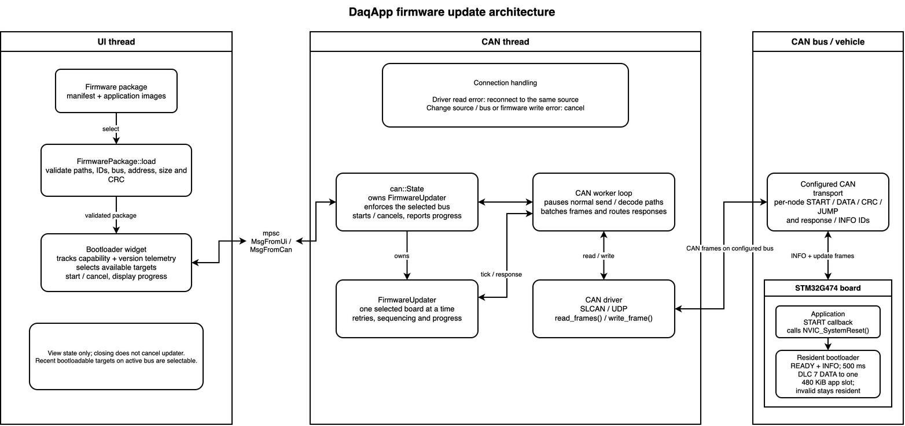
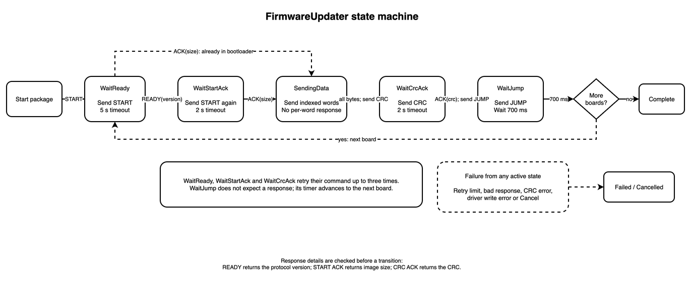

# DaqApp bootloader updates

This guide covers firmware updates from DaqApp. See the
[resident G4 bootloader guide](../../firmware/source/bootloader/README.md) for
architecture, protocol, flash layout, and recovery.

The updater supports the six STM32G474 VCAN nodes:
`main_module`, `dashboard`, `torque_vector`, `a_box`, `front_driveline`, and
`rear_driveline`.

## Prepare the firmware package

From the repository root, build the firmware and package:

```bash
python3 firmware/build_firmware.py
```

The command writes `firmware/output/manifest.json`,
`firmware/output/firmware_<git-ref>.tar.gz`, and resident images under
`firmware/output/bootloader_<NODE>/`. Flash the matching
`bootloader_<NODE>.bin` before the first application update. The archive contains
application payloads; it does not replace resident bootloaders.

## Update an application

1. Connect DaqApp to VCAN and confirm target telemetry is visible.
2. Open **Bootloader** from the sidebar or command palette.
3. Select `firmware/output/manifest.json` or `firmware_*.tar.gz`.
4. Select targets with recent bootloader telemetry for normal updates, or choose
**Select available**. A nonresponding target can also be selected for single-target
armed recovery.
5. Choose **Review update** and verify the target list. Choose **Start update** for
the normal automatic reset-and-update flow. For manual recovery, choose **Arm
and wait for READY**; DaqApp sends no reset/start frame while armed.
6. Keep power and CAN connected until DaqApp reports **Update complete**; verify telemetry.

Selected boards update sequentially. Front and rear driveline are separate nodes.

## Updater architecture and state machine





In the normal flow, DaqApp sends `START` to reset a running application into
the resident bootloader. After `READY`, it erases, transfers, validates, and
hands off the image. A target already in the resident bootloader starts directly.

Armed mode requires exactly one selected target and sends no CAN frames while
waiting. After arming, manually reset or power-cycle the target into the
resident bootloader. When its matching `READY` response arrives, DaqApp begins
the update automatically. Normal **Start update** requires recent bootloadable
telemetry for every selected target and supports multi-target sequential
updates. Cancel the armed wait from the Bootloader widget if the target does not
become ready.

See the [resident guide](../../firmware/source/bootloader/README.md) for
protocol and flash details.

**Cancel** stops DaqApp's host state machine but cannot undo target writes. Retry
a cancelled or failed board before vehicle use. The protocol has no
authentication or rollback; use stable power and a trusted bus.
