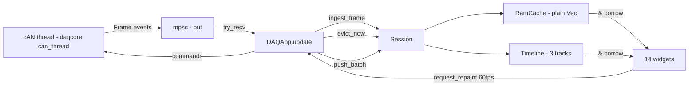

# daqcore as Composable Libraries — Option B (no monolithic engine)

Status: **Design proposal** (planning only — no code changes yet).
Branch: `millan/ram_cache`.
Companion to [`daqcore_engine_design.md`](daqcore_engine_design.md) ("Option A": daqcore
owns a monolithic `Engine` thread with `Arc<RwLock>`-shared cache/timeline). This doc is the
alternative ("Option B"): **daqcore is a tightly-coupled set of clean library modules with a
strict public function set — no `Arc`, no `RwLock`, no `Mutex` in any public type.** The UI
thread (daqapp) owns the state and bolts the pieces together.

The three binding constraints below are user-mandated and are copied **verbatim** from
[`daqcore_engine_design.md:14-32`](daqcore_engine_design.md:14) — they bind Option B exactly
as they bind Option A and are not revisited here.

---

## 0. Binding constraints (user-mandated, verbatim — do not re-litigate)

1. **Wall-clock timestamps.** Timeline timestamps are **wall-clock** (Unix millis UTC,
   `Time(i64)` newtype). The CAN thread applies the corrected timestamp **at parse time**.
   `chrono` is used **only for display labels**, never for ordering, arithmetic, or cache
   keys.
2. **Timeline tracks.** `Timeline` has `start` / `end` / `setpoint`, each with an
   independent `Track { Marching, Frozen }` — **all 9 combinations must be expressible**.
   Marching rules: `end = max(end, latest + follow_offset_secs)`,
   `start = end − window_secs`, `setpoint = end`; invariant
   `start <= setpoint <= end` (enforced by clamping inside setters/observe);
   **never silently move a Frozen field**.
3. **Naive RAM cache.**
   `Vec<CachedFrame>` (time-ascending) + `first_index: usize`
   + `latest: HashMap<(CanBus, u32), CachedFrame>`;
   `push` = append + ordering assert; `push_batch` = sorted merge;
   `evict` floor `max(timeline.start(), now − max_retention)`;
   `CAPACITY = 500_000`.
   Patches P1–P4 plus the Track/Timeline API from the comparison doc are already decided.
   (Note: `Vec` + offset, **not** `VecDeque` — `VecDeque::partition_point` is
   nightly-only, which is exactly why P3 exists.)

   **Patch P5 (user re-evaluation, supersedes the `latest` key in constraint 3).** The
   `(CanBus, u32)` key is **not** created: `CanBus` was intentionally removed in "DaqApp
   Bootloader updates, reset detection, metadata erasing (#489)" — it was cosmetic in the
   sidebar and not wired to anything, and today's `ParsedMessage`/`UnparsedMessage`
   ([`messages.rs:79-94`](../../daq/daqapp/src/messages.rs:79)) carry no bus field. The
   key is **`u32`-only** (msg_id without the extended flag) until a real dual-bus consumer
   exists; the `(bus, u32)` shape stays documented above only for that future
   re-scope. All Option B APIs in this doc use the `u32`-only key.

---

## 1. Option B in a paragraph

`daqcore` is **not** an engine. It is a library of clean, composable modules with a strict
public function set and **zero synchronization primitives in its public types** (no
`Arc`, `RwLock`, `Mutex`, `Atomic*` in any public API surface; the only channels are
`std::sync::mpsc` `Sender`/`Receiver` passed by the caller at spawn time, which are plain
`Send` handles, not shared state). daqcore provides: (a) a **CAN thread module**
(`can_thread`) that the caller spawns and manages with commands in / events out — it owns
driver I/O, the DBC parser, send scheduling, bus-load tracking, the live log writer, the HIL
engine, and the firmware-update state machine — **internally, a thin run loop composing
small single-responsibility components, not a monolith (§3.7)** — and it delivers
**parsed frames + events OUT
over an mpsc channel**; (b) the pure data modules `timeline` (`Time`/`Track`/`Timeline`) and
`cache` (`RamCache`, exactly the naive structures of Constraint 3); (c) a thin `Session`
helper that pairs a cache + timeline and exposes `ingest`/`evict`/`push_batch` so that
daqapp and daqcli share the ~40 lines of per-tick orchestration without either owning a
thread; (d) the moved leaf modules (`driver`, `bus_load`, `logger`, `hil`, `firmware`,
`formatter`, `connection`, `log_parse`, `can` ID utils). The UI thread keeps everything:
`DAQApp` holds `cache: RamCache` and `timeline: Timeline` (via `Session`) as **plain
fields**; its `update()` drains the can-thread channel, does `session.ingest_frame(frame)`
(per frame: `cache.push` + `timeline.observe`) and `session.evict(now)` (per tick), then
renders all widgets by taking plain `&RamCache` / `&Timeline` borrows — **the 60 fps read
path is a direct method call on same-thread data: no locks, no channel hop, no snapshot
staleness**. The deliberate inversion vs Option A: Option A keeps frame data off the
channel and shares the cache via `Arc<RwLock>`; Option B ships frames over the channel (exactly
today's pattern, [`messages.rs:15-34`](../../daq/daqapp/src/messages.rs:15)) and the cache
is single-threaded-owned. daqcli spawns the same can thread and runs the same `Session`
orchestration in `main()`.

---

## 2. daqcore module layout (old file → new module)

daqcore today is a pure lib: [`daqcore/src/lib.rs:1-22`](../../daq/daqcore/src/lib.rs:1)
(`pub mod can; pub mod log_parse;` + dummy `add`/`subtract`), deps
[`daq/daqcore/Cargo.toml:6-12`](../../daq/daqcore/Cargo.toml:6) (`can_decode`, `can-dbc`,
`chrono`, `log`, `bytemuck`, `csv` — no threads, no hardware).

| Old location (lines) | New location | Notes |
|---|---|---|
| [`daq/daqapp/src/can/driver.rs`](../../daq/daqapp/src/can/driver.rs) (435) | `daqcore/src/can/driver.rs` | Pure move. `Driver` trait ([`driver.rs:33-43`](../../daq/daqapp/src/can/driver.rs:33)), 4 impls, `create_driver` ([`driver.rs:424-434`](../../daq/daqapp/src/can/driver.rs:424)). Feature-gated: `serial`, `udp`, `simulated`, `loopback`. |
| [`daq/daqapp/src/can/thread.rs`](../../daq/daqapp/src/can/thread.rs) (421) | `daqcore/src/can_thread/{run,rx,decode,events}.rs` | **Decomposed, not pasted**: the ~310-line `start_can_thread` loop ([`thread.rs:107-420`](../../daq/daqapp/src/can/thread.rs:107)) splits into a thin orchestration `run()` (~150 lines) + per-concern components (§3.7). Timestamp becomes `Time::now()` stamped inside `FrameDecoder` (replacing `chrono::Local::now()` at [`thread.rs:39`](../../daq/daqapp/src/can/thread.rs:39)). Constants become a module `consts` block ([`thread.rs:3-12`](../../daq/daqapp/src/can/thread.rs:3)). |
| [`daq/daqapp/src/can/state.rs`](../../daq/daqapp/src/can/state.rs) (215) | `daqcore/src/can_thread/{tx,connection,firmware}.rs` | The 13-field `State` grab bag ([`state.rs:3-17`](../../daq/daqapp/src/can/state.rs:3)) is **abolished** and split into `SendTable` (send scheduling, [`state.rs:159-213`](../../daq/daqapp/src/can/state.rs:159), `DateTime<Local>` → `Time`), `ConnectionManager` (driver lifecycle, [`thread.rs:263-294`](../../daq/daqapp/src/can/thread.rs:263)), and `FirmwareSession` ([`state.rs:55-144`](../../daq/daqapp/src/can/state.rs:55), events *returned*, not sent) — §3.7. |
| [`daq/daqapp/src/messages.rs`](../../daq/daqapp/src/messages.rs) (106) | `daqcore/src/can_thread/types.rs` | `MsgFromUi` ([`messages.rs:3-13`](../../daq/daqapp/src/messages.rs:3)) → `CanThreadCommand`; `MsgFromCan` ([`messages.rs:15-34`](../../daq/daqapp/src/messages.rs:15)) → `CanThreadEvent`; `ParsedMessage`/`UnparsedMessage` merge into one `ParsedFrame` (§3.4). The one genuinely 1:1 row (rename + `Time`). **Deleted from daqapp.** |
| [`daq/daqapp/src/can/bootloader.rs`](../../daq/daqapp/src/can/bootloader.rs) (500) | `daqcore/src/can/firmware.rs` | `FirmwareUpdater`, `OutboundFrame`; feature `firmware`. |
| [`daq/daqapp/src/bootloader_protocol.rs`](../../daq/daqapp/src/bootloader_protocol.rs) (425) | `daqcore/src/can/firmware_protocol.rs` | Pure protocol parsing; feature `firmware`. |
| [`daq/daqapp/src/can/daq_parser.rs`](../../daq/daqapp/src/can/daq_parser.rs) (205) | `daqcore/src/can/logger.rs` | `DaqLogger` ([`daq_parser.rs:23`](../../daq/daqapp/src/can/daq_parser.rs:23)); CAN2-only binary flat log. |
| [`daq/daqapp/src/can/bus_load.rs`](../../daq/daqapp/src/can/bus_load.rs) (64) | `daqcore/src/can/bus_load.rs` | `BusLoadTracker`, 1/5/10/30 s windows. |
| [`daq/daqapp/src/hil/`](../../daq/daqapp/src/hil) (`engine.rs`, `run.rs`, `config.rs`, ~545) | `daqcore/src/hil/` | `HilEngine` ([`hil/engine.rs:47`](../../daq/daqapp/src/hil/engine.rs:47)) moves; `process_parsed` ([`hil/engine.rs:101`](../../daq/daqapp/src/hil/engine.rs:101)) changes signature from `&messages::ParsedMessage` to `&ParsedFrame`. `config::list_available_tests` ([`hil/config.rs:55`](../../daq/daqapp/src/hil/config.rs:55)) is file I/O — takes an explicit base-dir arg. Feature `hil`. |
| [`daq/daqapp/src/connection.rs`](../../daq/daqapp/src/connection.rs) (107) | `daqcore/src/connection.rs` | `ConnectionSource` ([`connection.rs:2`](../../daq/daqapp/src/connection.rs:2)), `CanBusSpeed` ([`connection.rs:51`](../../daq/daqapp/src/connection.rs:51)); serde impls move too. |
| [`daq/daqapp/src/formatter.rs`](../../daq/daqapp/src/formatter.rs) (311) | `daqcore/src/formatter.rs` | `&str → String` glob formatter; feature `formatting`. |
| [`daq/daqcore/src/can.rs`](../../daq/daqcore/src/can.rs) (26) | stays `daqcore/src/can.rs` | `EXTENDED_ID_FLAG` ([`can.rs:1`](../../daq/daqcore/src/can.rs:1)), `can_dbc_to_u32_*` — unchanged. |
| `daqcore/src/log_parse/` | stays | Offline CSV correlation; unchanged. |
| — (new) | `daqcore/src/timeline.rs` | `Time`, `Track`, `Timeline` — from the synthesis in [`ram_cache_handoff.md:35-57`](ram_cache_handoff.md:35) + API in [`ram_cache_design_v2.md:89-124`](ram_cache_design_v2.md:89). |
| — (new) | `daqcore/src/cache.rs` | `RamCache`, `CachedFrame`, `FramePayload`, `CAPACITY = 500_000` — Constraint 3, structures from [`ram_cache_handoff.md:35-57`](ram_cache_handoff.md:35). |
| — (new) | `daqcore/src/session.rs` | `Session` helper (§5.6). |
| — (new) | `daqcore/src/backfill.rs` | `.log` parse worker spawner (§4.4). |

**Why no `CanBus` enum.** Constraint 3's original key was `HashMap<(CanBus, u32), _>`, but
`CanBus` was intentionally removed in "DaqApp Bootloader updates, reset detection, metadata
erasing (#489)" — it was cosmetic in the sidebar and never wired to anything, and today's
frame messages carry no bus field ([`messages.rs:79-94`](../../daq/daqapp/src/messages.rs:79);
verified: the only `CanBus*` type in source is `CanBusSpeed` at
[`connection.rs:51`](../../daq/daqapp/src/connection.rs:51)). Option B therefore keys
`RamCache.latest` by plain `u32` and does **not** create the enum (see Patch P5, §0). Future
extension path: if a real second bus (e.g. vCAN + sCAN) is ever ingested simultaneously,
add `CanBus` to `daqcore::connection`, add a `bus` field to `ParsedFrame`/`CachedFrame`,
and widen the key to `(CanBus, u32)` — a contained change to three types plus the map key.

**daqapp keeps:** `app.rs`, `widgets.rs`, `ui/` (22 files, pure eframe), `settings.rs`
(JSON prefs), `shortcuts.rs`, `workspace.rs`, `action.rs`, `assets.rs`, `util.rs` (minus the
`util::can` ID helpers, which fold into `daqcore::can`), themes. **Deleted from daqapp:**
`messages.rs`, `frozen.rs` (phase 3), and the moved `can/*` / `hil/*` /
`bootloader_protocol.rs` / `formatter.rs` / `connection.rs` files (as `pub use` shims
during phases 0–2, then removed).

---

## 3. The CAN thread module (centerpiece of Option B)

### 3.1 Public API

```rust
// daqcore::can_thread

/// Everything the can thread needs before it can run. Built by the caller
/// (daqapp main, or daqcli main) — daqcore never reads config files itself.
#[derive(Debug, Clone)]
pub struct CanThreadConfig {
    pub dbc_path: Option<std::path::PathBuf>,   // re-loadable via DbcSelected
    pub log_folder: Option<std::path::PathBuf>, // live binary log (DaqLogger), CAN2 only
    pub hil_dir: std::path::PathBuf,            // presets/tests folder for the HIL engine
}

/// Commands UI → can thread. Mirrors today's MsgFromUi 1:1 (9 variants) + Stop.
pub enum CanThreadCommand {
    Connect(Option<connection::ConnectionSource>), // None = disconnect
    DbcSelected(std::path::PathBuf),
    AddSendMessage(can_thread::AddSendMessage),
    DeleteSendMessage { msg_id: u32 },
    UpdateLogFolder(std::path::PathBuf),
    Hil(hil::HilCommand),
    StartFirmwareUpdate(can::firmware::FirmwarePackage),
    ArmFirmwareUpdate(can::firmware::FirmwarePackage),
    CancelFirmwareUpdate,
    Stop,
}

/// Events can thread → UI. Mirrors today's MsgFromCan (9 variants) 1:1,
/// with timestamps already `Time` (Constraint 1: applied at parse).
pub enum CanThreadEvent {
    Frame(ParsedFrame),                 // replaces ParsedMessage + UnparsedMessage
    Disconnection,
    ConnectionSuccessful,
    ConnectionFailed(String),
    MessageSent { msg_id: u32, timestamp: Time, amount_left: Option<SendAmount> },
    BusLoad { load_1s: f32, load_5s: f32, load_10s: f32, load_30s: f32 },
    Hil(hil::HilSnapshot),
    FirmwareProgress(can::firmware::FirmwareProgress),
}

/// One received CAN frame, decoded if the DBC knows it. The UI does
/// `session.ingest_frame(&frame)` for every one — same code path for both
/// decoded and undecoded frames (today: two variants, [`messages.rs:15-34`](../../daq/daqapp/src/messages.rs:15)).
#[derive(Debug, Clone)]
pub struct ParsedFrame {
    pub timestamp: timeline::Time,        // Time::now() at parse, in the can thread
    pub msg_id: u32,                      // raw id, no extended flag (matches today)
    pub is_msg_id_extended: bool,
    pub raw_bytes: Vec<u8>,
    pub decoded: Option<can_decode::DecodedMessage>,
}

/// Spawn the can thread. Caller keeps `out` (the event receiver) and the handle.
pub fn spawn_can_thread(
    config: CanThreadConfig,
    out: std::sync::mpsc::Sender<CanThreadEvent>,
    cmd: std::sync::mpsc::Receiver<CanThreadCommand>,
) -> CanThreadHandle;

/// Owns the command side; joining is explicit so the caller controls shutdown.
pub struct CanThreadHandle { /* cmd_tx, stop flag, join: Option<JoinHandle<()>> */ }
impl CanThreadHandle {
    pub fn command(&self, cmd: CanThreadCommand);           // fire-and-forget, today's pattern
    pub fn stop(&mut self) -> std::thread::Result<()>;      // sends Stop, joins
}
```

`SendAmount`, `AddSendMessage`, `FirmwareProgress` move verbatim from
[`messages.rs:37-70`](../../daq/daqapp/src/messages.rs:37),
[`messages.rs:72-77`](../../daq/daqapp/src/messages.rs:72),
[`messages.rs:97-105`](../../daq/daqapp/src/messages.rs:97) (timestamp fields become
`Time`). All channel types are `Send` plain data — no locks, no `Arc`.

### 3.2 What the can thread OWNS (single owner, `&mut` only, never shared)

| Owned item | Source | Why here |
|---|---|---|
| `driver: Option<Box<dyn Driver>>` | [`state.rs:3-17`](../../daq/daqapp/src/can/state.rs:3) | I/O loop, connect/disconnect lifecycle ([`thread.rs:263-294`](../../daq/daqapp/src/can/thread.rs:263)) |
| `parser: Option<can_decode::Parser>` | [`thread.rs:123-129`](../../daq/daqapp/src/can/thread.rs:123) | Decoding happens at parse, same place the `Time` is stamped (Constraint 1) |
| `send_msgs: HashMap<u32, SendMsgInfo>` | [`state.rs:146-154`](../../daq/daqapp/src/can/state.rs:146) | Periodic send scheduling ([`thread.rs:188-260`](../../daq/daqapp/src/can/thread.rs:188)) |
| `bus_load_tracker` | [`thread.rs:361-385`](../../daq/daqapp/src/can/thread.rs:361) | 200 ms cadence, per-frame `record_frame` |
| `daq_logger` (live binary log) | [`thread.rs:354-358`](../../daq/daqapp/src/can/thread.rs:354) | Per-frame file write, CAN2 only |
| `hil_engine: HilEngine` | [`thread.rs:175-186`](../../daq/daqapp/src/can/thread.rs:175), [`thread.rs:56`](../../daq/daqapp/src/can/thread.rs:56) | §3.5 decision |
| `firmware_updater: Option<FirmwareUpdater>` | [`state.rs:55-144`](../../daq/daqapp/src/can/state.rs:55) | §3.5 decision |

In the §3.7 decomposition these rows map onto named components: `ConnectionManager`
(driver), `FrameDecoder` (parser), `SendTable` (send table), `FirmwareSession` (wraps
`FirmwareUpdater`), plus the already-independent `bus_load` / `logger` / `hil` modules
ticked at their existing cadences.

### 3.3 What the can thread must NOT own

- **`RamCache` and `Timeline`.** They are UI-thread state (Option B's defining choice).
  The thread only *emits* `Frame` events; it never mutates cache or timeline.
- **`Settings` / UI preferences** (`theme`, `pixels_per_point`,
  [`settings.rs`](../../daq/daqapp/src/settings.rs)) — app-level, stay in daqapp;
  `CanThreadConfig` carries only what the thread needs.
- **Widget state.** Obvious.

### 3.4 Sub-decision (b): frame delivery over the channel — confirmed

Yes: frames travel OUT over a plain unbounded `std::sync::mpsc`, exactly like today
(`MsgFromCan::ParsedMessage`/`UnparsedMessage` carry `DecodedMessage` by value in
[`messages.rs:79-94`](../../daq/daqapp/src/messages.rs:79); the UI drains with
`try_recv` in `update()` at [`app.rs:216-263`](../../daq/daqapp/src/app.rs:216)).
Option B keeps this pattern byte-for-byte in spirit — the only changes are the
timestamp type (`DateTime<Local>` → `Time`, Constraint 1) and merging the two message
variants into one `Frame` event. Two consequences worth stating:

- **Zero clone cost.** `DecodedMessage` and `raw_bytes` are *moved* into the channel
  message, exactly as today. The per-frame cost is the mpsc hop itself, which already
  exists today — Option B adds no new hot-path traffic.
- **This is the exact inversion of Option A** (whose design notes explicitly keep frame
  data *off* the event channel and instead share the cache via `Arc<RwLock>` —
  [`daqcore_engine_design.md:339-377`](daqcore_engine_design.md:339)). Option B accepts
  "data on the channel, state single-owned" over "no data on the channel, state
  lock-shared". See §9 for the trade-off analysis.

### 3.5 Sub-decision (a): HIL + firmware placement — **both stay IN the can thread**

Evaluated both placements; Option B keeps **HIL and firmware as daqcore-owned state
machines ticked inside the can thread** (they move with the thread as opaque
`daqcore` modules — the thread's body calls `hil_engine.tick()` /
`firmware_tick()` / `process_parsed()` exactly as today).

**Firmware: no realistic alternative.** The update protocol is entangled with the driver
read loop: 8 frames per tick with a 4 ms inter-frame sleep
(`FIRMWARE_FRAMES_PER_TICK`/`FIRMWARE_FRAME_DELAY_MS`,
[`thread.rs:3-12`](../../daq/daqapp/src/can/thread.rs:3);
[`thread.rs:296-318`](../../daq/daqapp/src/can/thread.rs:296)), and the *receive* path
filters bootloader response frames per frame during an update
(`firmware_frame_received`, [`thread.rs:333-347`](../../daq/daqapp/src/can/thread.rs:333),
[`state.rs:127-144`](../../daq/daqapp/src/can/state.rs:127)). Moving the state machine to
the UI thread would mean (1) the UI thread owning the 4 ms pacing — impossible at a 60 fps
frame cadence with variable vsync, and (2) the response filtering split across two threads
(reads in the can thread, protocol state in the UI thread) — a channel round-trip per
response frame. Not viable.

**HIL: could go either way, but in-thread wins.** The engine is observation-only
(`process_parsed` at [`hil/engine.rs:101`](../../daq/daqapp/src/hil/engine.rs:101),
`tick` at [`hil/engine.rs:112`](../../daq/daqapp/src/hil/engine.rs:112), `snapshot` at
[`hil/engine.rs:123`](../../daq/daqapp/src/hil/engine.rs:123) — no driver writes), so a
UI-thread HIL wouldn't fight the thread for hardware. But: (1) the 50 ms tick
(`HIL_UPDATE_MS`, [`thread.rs:3-12`](../../daq/daqapp/src/can/thread.rs:3)) is a fixed
cadence — ticking it from the UI thread makes its period depend on vsync and on how many
frames were drained that tick (expectation-window timing in
[`hil/run.rs:112-131`](../../daq/daqapp/src/hil/run.rs:112) would silently drift under
frame drops); (2) keeping it in-thread is *zero behavior change* vs today
([`thread.rs:175-186`](../../daq/daqapp/src/can/thread.rs:175)); (3) it keeps the
"one state machine, one owning thread" rule uniform — every mutable state machine in
daqcore has exactly one `&mut` owner. The UI receives `Hil(HilSnapshot)` events (50 ms
throttle unchanged) and renders them; `daqcli hil run` consumes the same events.

Net: the can thread owns *all* mutable state machines; the UI thread owns *all* read-mostly
render state. No mutable state is ever shared.

### 3.6 Threading shape (Option B)

```
        ┌──────────────────────── daqcore (library) ────────────────────────┐
        │  can_thread module                    timeline / cache / session  │
        └───────────────────────────────────────────────────────────────────┘
   std::thread: CAN                          UI thread (eframe) / daqcli main
   ┌─────────────────────────┐              ┌────────────────────────────────┐
   │ owns: driver, parser,   │  mpsc (out)  │ owns: Session { RamCache,      │
   │ send table, bus load,   │ ───────────► │   Timeline }, widget state,    │
   │ DaqLogger, HilEngine,   │  Frame,      │ connection status, hil snap,   │
   │ FirmwareUpdater         │  events      │ firmware progress              │
   │                         │              │ update(): drain → ingest_frame │
   │ loop: drain cmds, HIL   │  mpsc (in)   │       → evict → render with    │
   │ tick, sends, firmware,  │ ◄─────────── │       &cache / &timeline       │
   │ read_frames, decode,    │  commands    │        (plain borrows)         │
   │ stamp Time, emit        │              │                                │
   └─────────────────────────┘              └────────────────────────────────┘
```

One thread difference vs Option A to be explicit about: in Option A the cache/timeline
live on the *engine* thread behind `Arc<RwLock>`; here they live on the *reader* thread.
Both designs have exactly one writer for the cache (the difference is which thread it is
and how the reader gets in).

### 3.7 Internal architecture: the can thread as a composition of submodules (refactor, not paste)

**The problem, precisely.** The current can thread is a jumble, and Option B does *not*
paste it into daqcore as-is. Verified tangles (line ranges on `millan/ram_cache`):

- `start_can_thread` ([`thread.rs:107-420`](../../daq/daqapp/src/can/thread.rs:107)) is a
  ~310-line loop interleaving **eight** concerns: command drain ([`thread.rs:120-173`](../../daq/daqapp/src/can/thread.rs:120)),
  HIL tick + 50 ms snapshot ([`thread.rs:175-186`](../../daq/daqapp/src/can/thread.rs:175)),
  send scheduling + driver write ([`thread.rs:188-260`](../../daq/daqapp/src/can/thread.rs:188)),
  connection lifecycle ([`thread.rs:263-294`](../../daq/daqapp/src/can/thread.rs:263)),
  firmware burst ([`thread.rs:296-318`](../../daq/daqapp/src/can/thread.rs:296)),
  read + decode + filter + log + bus-load ([`thread.rs:321-415`](../../daq/daqapp/src/can/thread.rs:321)).
- `process_can_frame` ([`thread.rs:31-105`](../../daq/daqapp/src/can/thread.rs:31)) mixes
  decode, chrono stamping (line 39), the HIL callback (line 56), and two inline channel
  sends (57-60, 85-88) in one function.
- `State` ([`state.rs:3-17`](../../daq/daqapp/src/can/state.rs:3)) is a 13-field grab bag
  (2 channels + driver + 4 subsystems + 5 cadence bookkeeping fields); its methods
  interleave the firmware protocol with inline event sends ([`state.rs:55-144`](../../daq/daqapp/src/can/state.rs:55))
  and send scheduling with chrono ([`state.rs:159-213`](../../daq/daqapp/src/can/state.rs:159)).
- Event sends are scattered with `.expect()` across both files; `chrono::Local::now()`
  appears in four separate places ([`thread.rs:39`](../../daq/daqapp/src/can/thread.rs:39),
  [`thread.rs:220`](../../daq/daqapp/src/can/thread.rs:220), [`state.rs:160`](../../daq/daqapp/src/can/state.rs:160),
  [`state.rs:207`](../../daq/daqapp/src/can/state.rs:207)).

**The design: small components composed by a thin run loop.**

| Component | New file | Absorbs (today) | Contract |
|---|---|---|---|
| `Events` | `can_thread/events.rs` | every scattered `.send(...).expect()` call site (e.g. [`thread.rs:57-60`](../../daq/daqapp/src/can/thread.rs:57), [`state.rs:55-144`](../../daq/daqapp/src/can/state.rs:55)) | the **single** send choke point; `fn emit(&self, ev: CanThreadEvent)`; the only type in the module holding the `Sender` |
| `ConnectionManager` | `can_thread/connection.rs` | [`thread.rs:263-294`](../../daq/daqapp/src/can/thread.rs:263) + `driver: Option` field + 200 ms disconnected sleep | `connect(source)`, `write_frame()`, `read_frames()`, `close()`; returns connection *events* to the caller instead of sending them |
| `FrameDecoder` | `can_thread/decode.rs` | [`thread.rs:31-105`](../../daq/daqapp/src/can/thread.rs:31) minus the HIL call and the sends | `decode(&mut self, frame: &slcan::CanFrame, now: Time) -> ParsedFrame`; owns `Option<can_decode::Parser>`; the **only** place a `Time` stamp is applied (Constraint 1) |
| `SendTable` | `can_thread/tx.rs` | [`state.rs:19-30`](../../daq/daqapp/src/can/state.rs:19), [`state.rs:146-185`](../../daq/daqapp/src/can/state.rs:146), [`state.rs:189-213`](../../daq/daqapp/src/can/state.rs:189) | `add`/`delete`/`due(now: Time) -> Vec<SendTick>`; pure due-time math with an injected clock — directly unit-testable |
| `FirmwareSession` | `can_thread/firmware.rs` | [`state.rs:55-144`](../../daq/daqapp/src/can/state.rs:55) + the burst loop [`thread.rs:296-318`](../../daq/daqapp/src/can/thread.rs:296) | `start(package, armed)`, `tick(now: Instant) -> Vec<OutboundFrame>` (≤ 8 per tick; the caller paces the 4 ms delay), `frame_received(id, data) -> Option<FirmwareProgress>` — progress is **returned**, never sent inline |
| `RxLoop` | `can_thread/rx.rs` | the read half of [`thread.rs:321-415`](../../daq/daqapp/src/can/thread.rs:321) | per-read error classification (Timeout → 2 ms retry flag; other → `ConnectionFailed` event), firmware-response filtering ([`thread.rs:333-347`](../../daq/daqapp/src/can/thread.rs:333)); returns a `ReadOutcome` enum, sends nothing |
| (existing modules, used as-is) | — | `bus_load::BusLoadTracker`, `can::logger::DaqLogger`, `hil::HilEngine`, `can::firmware::FirmwareUpdater` | unchanged — they are *already* single-concern; the run loop ticks them at the existing cadences |
| `run` | `can_thread/run.rs` | the *structure* of [`thread.rs:107-420`](../../daq/daqapp/src/can/thread.rs:107) only | ~120–150 lines, orchestration only: drain commands → HIL tick → sends (`SendTable` → `ConnectionManager`) → firmware burst → read (`RxLoop`) → decode → bus-load → log → `events.emit(...)` per returned event. **No protocol knowledge.** |

**The rules that make the split real, not cosmetic:**

1. **Components are dumb state machines.** Each is a struct with `&mut self` methods and
   no `Sender` inside (except `Events`). Clocks are **injected per call** (`now: Time` /
   `now: Instant`) — one `now` per loop iteration replaces the four independent
   `chrono::Local::now()` call sites.
2. **Return events, don't send them.** Components return `Option<T>` / `Vec<T>`; the run
   loop is the only place `events.emit(...)` is called. ~12 scattered send sites collapse
   into the run loop body.
3. **Behavior is preserved exactly.** The constants ([`thread.rs:3-12`](../../daq/daqapp/src/can/thread.rs:3)),
   the event *order*, the channel types, and all cadences (50 ms HIL, 200 ms bus-load,
   8×4 ms firmware) are unchanged — the refactor changes *structure*, not behavior.
4. **Proven before it moves.** The refactor ships with (a) headless unit tests on the new
   components (send-table due-time matrix with fake clocks, firmware-session script,
   decode on hand-built frames, `RxLoop` error classification against `LoopbackDriver`),
   and (b) a 10-min loopback/serial scenario that diffs the *old* vs *new* event stream
   (a debug-only `Events` mirror — same technique as the Phase 1 shadow harness).

**Payoff.** Phase 2b's crate move becomes genuinely low-risk: it moves a module that was
just decomposed and stream-verified, not a 421-line monolith. Every component is
headlessly unit-testable in daqcore — something Option A's `EngineInner` is structurally
worse at, since its internals stay welded to the engine thread.

**Generalized to the whole migration:** the same "clean up while moving" standard applies
to every row of §2 — `hil/config.rs` gains an explicit base-dir argument, `formatter` /
`connection` / `log_parse` move as-is (they are already single-concern), and
`messages.rs` is the only genuinely 1:1 row (rename + `Time`).

---

## 4. UI-thread orchestration sketch

### 4.1 `DAQApp` fields (before → after)

```rust
// daqapp::app  (after Option B migration)
pub struct DAQApp {
    // NEW — Option B's defining fields: plain, single-owner, no locks
    session: daqcore::Session,                 // owns RamCache + Timeline
    can_thread: daqcore::can_thread::CanThreadHandle,
    can_to_ui: std::sync::mpsc::Receiver<daqcore::can_thread::CanThreadEvent>,
    backfill_rx: Option<std::sync::mpsc::Receiver<daqcore::backfill::BackfillBatch>>,

    // unchanged UI-only state
    widgets: /* egui_tiles layout, widget registry, ... */,
    connection_status: /* from ConnectionSuccessful/Failed events */,
    hil_snapshot: daqcore::hil::HilSnapshot,   // last received, rendered as-is
    firmware_progress: Option<daqcore::can::firmware::FirmwareProgress>,
    bus_load: (f32, f32, f32, f32),
    settings: settings::Settings,              // stays daqapp
}
```

### 4.2 `DAQApp::update()` flow

Today: `update()` drains `can_to_ui_rx` into a frame-local `can_messages: Vec<MsgFromCan>`
and repaints unconditionally ([`app.rs:216-263`](../../daq/daqapp/src/app.rs:216));
ingestion is entangled with rendering because widgets receive `can_messages` during
`show()` ([`widgets.rs:68-78`](../../daq/daqapp/src/widgets.rs:68)). Option B splits them:

```rust
fn update(&mut self, ctx: &egui::Context, _frame: &mut eframe::Frame) {
    // 1. DRAIN + INGEST (was: build can_messages; now: mutate the session directly)
    while let Ok(event) = self.can_to_ui.try_recv() {
        match event {
            CanThreadEvent::Frame(frame) => {
                // cache.push (append + ordering assert) + timeline.observe(latest)
                let changed = self.session.ingest_frame(&frame);
                if changed { /* optional: mark LIVE badge etc. */ }
            }
            CanThreadEvent::BusLoad { .. } => { self.bus_load = ..; }
            CanThreadEvent::Hil(s) => { self.hil_snapshot = s; }
            CanThreadEvent::FirmwareProgress(p) => { self.firmware_progress = Some(p); }
            CanThreadEvent::ConnectionSuccessful | Disconnection | ConnectionFailed(_) => { .. }
            CanThreadEvent::MessageSent { .. } => { /* send-queue widget state */ }
        }
    }

    // 2. BACKFILL (only while Disconnected): one batch per update
    if let Some(rx) = &self.backfill_rx {
        while let Ok(batch) = rx.try_recv() {
            self.session.push_batch(std::mem::take(&mut batch.frames)); // sorted merge
        }
    }

    // 3. PER-TICK MAINTENANCE (marching + eviction floor, Constraint 3)
    self.session.evict_now();   // floor = max(timeline.start(), now - max_retention)

    // 4. RENDER — widgets take &RamCache / &Timeline via WidgetContext
    egui_tiles::CentralPanel::default().show(ctx, |ui| {
        let mut wc = WidgetContext {
            cache: self.session.cache(),       // &RamCache  — plain borrow
            timeline: self.session.timeline(), // &Timeline  — plain borrow
            hil: &self.hil_snapshot, ..        // unchanged
        };
        for widget in self.widgets.iter_mut() { widget.show(ui, &mut wc); }
    });

    // Timeline bar (Slider/drag per field): writes set_*/release_* directly on
    // self.session.timeline_mut() — UI thread is the sole owner, so Constraint 2
    // compliance is by construction, no messaging round-trip needed.

    ctx.request_repaint(); // unchanged: unconditional ([app.rs:263](../../daq/daqapp/src/app.rs:263))
}
```

Mermaid:



**The selling point, made concrete:** the 60 fps read path is `widget.show()` calling
`cache.frames_in_range(...)` / `timeline.range()` on **same-thread data through a plain
`&` borrow**. No `RwLockReadGuard`, no channel, no snapshot staleness, no
`latest_frame()` clone. The widget migration itself (14 widgets, `Frozen<T>` →
cache reads) is *identical* to the migration in
[`ram_cache_design_v2.md:346-387`](ram_cache_design_v2.md:346) — Option B changes **where
the cache lives** (UI thread, plain fields) but not what widgets do.

### 4.3 Why ingestion moves out of `show()`

In Option B, `can_messages` disappears entirely: the session is mutated during drain
(step 1), before any widget renders (step 4). This removes the existing
drain-during-update / consume-during-show split and makes a widget's view of the cache
exactly "everything received before this frame" — deterministic per frame.

### 4.4 Backfill path (`.log` → cache)

`daqcore::backfill` provides the worker spawner; the **cache mutation stays on the UI
thread**:

```rust
// daqcore::backfill
pub struct BackfillBatch { pub frames: Vec<cache::CachedFrame> } // e.g. 2_000 frames

pub fn spawn_log_worker(
    log_path: std::path::PathBuf,
    out: std::sync::mpsc::Sender<BackfillBatch>,
    cancel: std::sync::mpsc::Sender<()>,
) -> std::thread::JoinHandle<()>;
// worker: daqcore::log_parse per record → build CachedFrame with the log's own
// timestamps (already wall-clock at the source) → ship in time-ascending chunks.
```

- Only allowed while `Disconnected` (same rule as
  [`ram_cache_handoff.md:60-67`](ram_cache_handoff.md:60)); the UI refuses the file-open
  otherwise.
- The UI thread runs `session.push_batch(chunk)` — a sorted merge (P4) — a few times per
  frame. **Lock-free by construction**: the cache is single-threaded-owned, so there is
  no synchronization question at all; the only cost is a few hundred µs of UI-thread
  work per batch, spread one-batch-per-`try_recv` so the UI never stalls more than one
  merge.
- This is the one place Option B and Option A make *different* thread choices: Option A
  runs `push_batch` on the engine thread (UI reads through `RwLock` meanwhile); Option B
  runs it on the UI thread (nothing else can touch the cache meanwhile — it *is* the
  cache's owner). Both are correct; Option B's is the one that needs no locking.

---

## 5. The full daqcore public API surface (strict)

**Rule (enforced, testable):** no `Arc`, `RwLock`, `Mutex`, `Condvar`, or
`Atomic*` appears in any public type, signature, or field. Every stateful public type
documents its **single owning thread** in its doc comment. The only cross-thread types
are `mpsc::Sender<T>`/`Receiver<T>` (plain `Send` handles) passed by the caller.

### 5.1 `daqcore::timeline`

```rust
#[derive(Debug, Clone, Copy, PartialEq, Eq, PartialOrd, Ord, Hash)]
pub struct Time(i64); // wall-clock Unix millis UTC (Constraint 1)

impl Time {
    pub fn now() -> Self;
    pub fn from_unix_millis(ms: i64) -> Self;
    pub fn unix_millis(self) -> i64;
    pub fn secs(self, other: Time) -> f64;
    pub fn label(self) -> String; // chrono, display ONLY
}

#[derive(Debug, Clone, Copy, PartialEq, Eq)]
pub enum Track { Marching, Frozen }

pub struct Timeline { /* start, end, setpoint + 3×Track + window_secs +
                        follow_offset_secs + max_retention (Constraint 2) */ }

impl Timeline {
    pub fn live(now: Time, window_secs: f64) -> Self;
    pub fn observe(&mut self, latest: Time) -> bool; // marching re-derive; false = no move
    pub fn start(&self) -> Time;
    pub fn end(&self) -> Time;
    pub fn setpoint(&self) -> Time;
    pub fn is_live(&self) -> bool;
    pub fn set_start(&mut self, t: Time);            // freezes track + clamps
    pub fn set_end(&mut self, t: Time);
    pub fn set_setpoint(&mut self, t: Time);
    pub fn release_start(&mut self);
    pub fn release_end(&mut self);
    pub fn release_setpoint(&mut self);              // "go live"
    pub fn set_window_secs(&mut self, secs: f64);
    pub fn set_follow_offset_secs(&mut self, secs: f64);
    pub fn set_max_retention(&mut self, d: std::time::Duration);
    pub fn max_retention(&self) -> std::time::Duration;
    pub fn range(&self) -> std::ops::Range<Time>;
    pub fn setpoint_range(&self) -> std::ops::Range<Time>;
}
```

(API as decided in [`ram_cache_design_v2.md:89-133`](ram_cache_design_v2.md:89),
invariants §2.4; identical in both options — the constraint fixes it.)

### 5.2 `daqcore::cache`

```rust
pub struct CachedFrame {
    pub timestamp: Time,
    pub msg_id: u32,                 // no extended flag; key of `latest` (Patch P5, §0)
    pub is_msg_id_extended: bool,
    pub payload: FramePayload,
}
pub enum FramePayload {
    Decoded { raw_bytes: Vec<u8>, decoded: can_decode::DecodedMessage },
    Undecoded { raw_bytes: Vec<u8> },
}

pub const CAPACITY: usize = 500_000;

pub struct RamCache { /* frames: Vec<CachedFrame>, first_index: usize,
                        latest: HashMap<u32, CachedFrame> (Constraint 3, Patch P5) */ }

impl RamCache {
    pub fn new() -> Self;
    pub fn push(&mut self, frame: CachedFrame) -> bool;          // append + ordering assert
    pub fn push_batch(&mut self, batch: Vec<CachedFrame>);       // sorted merge
    pub fn evict(&mut self, floor: Time) -> usize;               // P1+P2
    pub fn len(&self) -> usize;
    pub fn is_empty(&self) -> bool;
    pub fn time_span(&self) -> Option<(Time, Time)>;
    pub fn latest(&self, msg_id: u32) -> Option<&CachedFrame>;
    pub fn latest_map(&self) -> &HashMap<u32, CachedFrame>;
    pub fn frames_in_range(&self, range: (Time, Time)) -> &[CachedFrame];
    pub fn frames_before(&self, ts: Time, count: usize) -> &[CachedFrame];
    pub fn signal_series(&self, msg_id: u32, signal: &str,
                         range: (Time, Time)) -> Vec<(Time, f64)>;
}
```

Structures verbatim from [`ram_cache_handoff.md:35-57`](ram_cache_handoff.md:35).
`CachedFrame` carries `is_msg_id_extended` because today's `ParsedMessage` does
([`messages.rs:79-86`](../../daq/daqapp/src/messages.rs:79)).

### 5.3 `daqcore::can_thread`

As §3.1: `CanThreadConfig`, `CanThreadCommand`, `CanThreadEvent`, `ParsedFrame`,
`SendAmount`, `AddSendMessage`, `spawn_can_thread`, `CanThreadHandle`.
**Owner:** the returned thread. No state is shared out except by value over the channel.
**Internal structure is private:** the §3.7 components (`Events`, `ConnectionManager`,
`FrameDecoder`, `SendTable`, `FirmwareSession`, `RxLoop`, `run`) are module internals —
the surface above is the module's entire public API.

### 5.4 `daqcore::can` (drivers + peripherals)

```rust
pub type DriverResult<T> = Result<T, DriverError>;
pub trait Driver { fn read_frames(&mut self) -> DriverResult<Vec<slcan::CanFrame>>;
                   fn write_frame(&mut self, f: slcan::CanFrame) -> DriverResult<()>;
                   fn is_connected(&self) -> bool;
                   fn bus_speed(&self) -> Option<connection::CanBusSpeed>;
                   fn close(&mut self) -> DriverResult<()>; }
pub fn create_driver(source: &connection::ConnectionSource) -> DriverResult<Box<dyn Driver>>;
pub struct BusLoadTracker { /* 1/5/10/30 s */ pub fn new(); pub fn record_frame(&mut self, bits: usize, now: std::time::Instant); pub fn get_load(&self, secs: f32) -> f32; }
pub struct DaqLogger { /* binary flat log, CAN2 only */ }
pub mod firmware { pub struct FirmwareUpdater; pub struct FirmwarePackage; pub struct OutboundFrame; pub struct FirmwareProgress { /* from messages.rs:97-105 */ } }
pub mod firmware_protocol;
// ID utils (unchanged): EXTENDED_ID_FLAG, can_dbc_to_u32_with/without_extid_flag
```

### 5.5 `daqcore::hil` / `daqcore::formatter` / `daqcore::connection` / `daqcore::log_parse`

Moved modules with the same public surface as today, minus daqapp-type dependencies:
`HilEngine::process_parsed(&mut self, frame: &can_thread::ParsedFrame)` (was
`&messages::ParsedMessage`), `config::load_test_from_file(dir, basename)`. `formatter`
is the glob-based `&str → String` library (feature `formatting`). `connection` is
unchanged (`ConnectionSource`, `CanBusSpeed` only — no `CanBus`, §2). `log_parse`
unchanged.

### 5.6 `daqcore::session` — the orchestration helper (decision: **adopt it**)

```rust
/// Pairs the cache and timeline and does the per-tick bookkeeping that both
/// daqapp and daqcli must perform. SINGLE OWNERSHIP: constructed on the UI/main
/// thread, never shared. Contains no thread, no channel, no atomic — it is data
/// plus methods. (This is the guardrail that keeps Option B from drifting into
/// Option A's Engine: if Session ever needs a Sender or a lock, stop and re-scope.)
pub struct Session { cache: RamCache, timeline: Timeline }

impl Session {
    pub fn live(now: Time, window_secs: f64, follow_offset_secs: f64,
                max_retention: std::time::Duration) -> Self;
    /// Per received frame: cache.push + timeline.observe. Returns true if the
    /// timeline moved (repaint hint / LIVE badge).
    pub fn ingest_frame(&mut self, frame: &ParsedFrame) -> bool;
    /// Per tick: evict with floor = max(timeline.start(), now - max_retention).
    pub fn evict_now(&mut self);
    /// Backfill path (UI thread only): sorted-merge a batch.
    pub fn push_batch(&mut self, frames: Vec<CachedFrame>);
    pub fn cache(&self) -> &RamCache;
    pub fn timeline(&self) -> &Timeline;
    pub fn timeline_mut(&mut self) -> &mut Timeline;
}
```

**Evaluation (required by the task):** is this still "library" or does it drift back to
Option A's engine?

- **It is still library, for three structural reasons:** (1) it owns **no thread** — the
  option-A `Engine` *is* a thread with a command channel; `Session` has neither; (2) it
  owns **no synchronization primitive** — Option A's `Engine` public surface exposes
  `cache: Arc<RwLock<RamCache>>` / `timeline: Arc<RwLock<Timeline>>` (see
  [`daqcore_engine_design.md:255-338`](daqcore_engine_design.md:255)); `Session`'s fields
  are private plain data, accessible only through `&`/`&mut` on the owning thread; (3) it
  **cannot be called from two threads** — the type system enforces single ownership
  (`&mut self` only), so there is no "concurrent use" question at all. It is the same
  category of object as `std::collections::BTreeMap`: data + methods, one owner.
- **Why adopt it anyway:** without it, daqapp and daqcli each re-implement the
  drain → `push` → `observe` → `evict` loop (~40 lines, including the Constraint-3 evict
  floor `max(timeline.start(), now − max_retention)` and the "merged undecoded frame
  refreshes `latest`" rule). Two copies of a subtle rule is exactly how they drift
  apart — Option B's biggest duplication risk (§9, row "daqcli reuse"). `Session` is the
  minimal shared surface that eliminates that risk without adding any concurrency.
- **Drift guardrail (documented, not just hoped):** the rule "no `Arc`/lock/atomic in any
  public type" applies to `Session` with extra force, and is checkable with a grep-style
  doc-test or a `compile_fail` test asserting `Session` is `!Send`-shared... concretely:
  `Session` will **not** implement `Send`-friendly sharing APIs; review rule: any PR
  adding a `Sender`/`Receiver`/atomic field to `Session` is a re-scope to Option A and
  must be approved as such.

---

## 6. daqcli sketch (validates pollability)

`daqcli` today is a 6-line stub
([`daq/daqcli/src/main.rs:1-6`](../../daq/daqcli/src/main.rs:1)). Option B's CLI is
*structurally identical to daqapp's main loop*: spawn the can thread, own a `Session`,
drain, ingest, evict, print.

```rust
// daqcli main (sketch)
fn main() {
    let cli = clap::Parser::parse(); // connect | watch <msg> | status | send | hil run <preset> | backfill <file>

    let (out_tx, out_rx) = mpsc::channel();
    let (cmd_tx, cmd_rx) = mpsc::channel();
    let mut can_thread = daqcore::can_thread::spawn_can_thread(config_from_cli(&cli), out_tx, cmd_rx);
    let mut session = daqcore::Session::live(Time::now(), cli.window, cli.follow, cli.retention);

    loop {
        // command pump for interactive subcommands (send / hil run / arm ...)
        pump_stdin(&mut cmd_tx, &cli);

        while let Ok(event) = out_rx.try_recv() {
            match event {
                CanThreadEvent::Frame(f) => {
                    session.ingest_frame(&f);
                    if let Some(watch) = &cli.watch {
                        if f.msg_id == watch.id { print_frame(&f); } // prints live
                    }
                }
                CanThreadEvent::BusLoad { .. } => if cli.status { print_bus_load(..); }
                CanThreadEvent::Hil(s) => if cli.hil { print_hil(&s); }   // hil run <preset>
                CanThreadEvent::FirmwareProgress(p) => { print_progress(&p); }
                _ => { /* status line updates */ }
            }
        }
        session.evict_now();
        std::thread::sleep(std::time::Duration::from_millis(10)); // CLI cadence, not 60fps
    }
}
```

Subcommands vs the API: `connect`/`status` → `Connect(source)` + event readout;
`watch <msg>` → filter `Frame` events (or, for history, `session.cache().frames_before`
+ `signal_series` after a scrub); `send` → `AddSendMessage`/`DeleteSendMessage`;
`hil run <preset>` → `Hil(HilCommand::StartTest)` + render `Hil` snapshots;
`backfill <file>` → `spawn_log_worker` + `session.push_batch` (no GUI, prints counts).
Compared with Option A, daqcli is a **peer** (spawns the same can thread, runs the same
`Session`) rather than a **client** (sending `EngineCommand`s and receiving
`EngineEvent`s). That is a *feature* here: `watch` needs every frame, and Option B's
channel already delivers every frame to the UI thread by design — daqcli gets the same
stream for free.

---

## 7. Dependencies & feature flags

daqcore today: [`daq/daqcore/Cargo.toml:6-12`](../../daq/daqcore/Cargo.toml:6)
(`can_decode`, `can-dbc`, `chrono`, `log`, `bytemuck`, `csv`). daqapp today carries the
hardware deps: [`daq/daqapp/Cargo.toml:6-40`](../../daq/daqapp/Cargo.toml:6) (incl.
`slcan` **git** dep with `features=["sync"]`, `serialport 4.8.1`, `rand 0.10.1`,
`globset`, `indexmap`, `hashbrown`).

| Dep | Today in | Moves to daqcore? | Feature | Notes |
|---|---|---|---|---|
| `can_decode 0.7.2`, `can-dbc 9.0.0` | both (workspace) | already | default | parser + DBC |
| `chrono 0.4.44` | both (workspace) | already | default | `Time::label()`, `log_parse` display — **display only** (Constraint 1) |
| `log`, `bytemuck`, `csv` | daqcore (workspace) | already | default / `logging` | `log_parse`, `DaqLogger` |
| `slcan` (**git**, `features=["sync"]`) | daqapp | **yes** | `serial`, `udp`, `simulated` (shared) | `Driver` trait uses `slcan::CanFrame` as wire type ([`driver.rs:33-43`](../../daq/daqapp/src/can/driver.rs:33)); `CanBusSpeed::to_slcan_bitrate` ([`connection.rs:83-88`](../../daq/daqapp/src/connection.rs:83)). **Flag:** the git dep now sits in a *library* crate — any daqcore consumer inherits it. Mitigation: pin the rev in `[patch]`/workspace; vendor it; or isolate behind the three features so `--no-default-features` builds are git-dep-free. |
| `serialport 4.8.1` | daqapp | **yes** | `serial` | `SerialDriver` |
| `rand 0.10.1` | daqapp | **yes** | `simulated` | `SimulatedDriver` traffic |
| `globset 0.4.18` | daqapp | **yes** | `formatting` | formatter globs |
| `indexmap 2.14.0` (serde) | daqapp | **yes** | `hil` | `PresetsFile` ([`hil/config.rs:10-11`](../../daq/daqapp/src/hil/config.rs:10)) |
| `serde` / `serde_json` / `toml` | daqapp | **yes** (serde) | default (serde for `ConnectionSource`/`CanBusSpeed`), `hil` (toml/json presets) | `ConnectionSource` custom Deserialize moves with it ([`connection.rs:9-47`](../../daq/daqapp/src/connection.rs:9)) |
| `hashbrown` | daqapp | **no** — use std `HashMap` in daqcore | — | Option B's cache is plain `HashMap` per Constraint 3; daqapp keeps `hashbrown` if it wants it for UI-side maps |
| eframe/egui_tiles/egui_plot/walkers/rfd/env_logger | daqapp | **no** | — | UI-only, stay in daqapp |

Feature matrix:

| Feature | Default? | Enables |
|---|---|---|
| (default) | yes | `timeline`, `cache`, `session`, `connection`, `can` ID utils, `log_parse`, `backfill` (parse side), serde |
| `serial` | yes (daqapp) | `slcan`, `serialport`, `SerialDriver` |
| `udp` | yes (daqapp) | `slcan`, `UdpDriver` |
| `simulated` | yes (daqapp) | `slcan`, `rand`, `SimulatedDriver` |
| `loopback` | yes (daqapp) | `LoopbackDriver` |
| `hil` | yes (daqapp) | `indexmap`, `serde` presets, `hil/` |
| `firmware` | yes (daqapp) | `can/firmware.rs`, `firmware_protocol.rs` |
| `formatting` | yes (daqapp) | `globset`, `formatter.rs` |

daqapp: `daqcore = { workspace = true, features = ["serial","udp","simulated","loopback","hil","firmware","formatting"] }`.
daqcli (slim): `daqcore = { workspace = true, default-features = false, features = ["serial"] }` + add `hil`/`firmware` per subcommand — **a daqcli build without `serial` has no `slcan`/git dep at all.** Option A cannot offer this: its monolithic `Engine` needs every driver feature, so a slim daqcli still drags in the git dep.

---

## 8. Phased migration plan

Same phase *granularity* and exit-criteria style as Option A
([`daqcore_engine_design.md:492-561`](daqcore_engine_design.md:492)); phase **names differ**
because Option B has no "engine handle" phase — the differentiating work (can thread as a
daqcore module) is its Phase 2, and there is no Phase for replacing mpsc with a shared
cache.

### Phase 0 — Pure leaf-module moves, zero behavior change

Move `driver`, `bus_load`, `DaqLogger`, `connection`, `formatter`,
`hil/`, `firmware` + `firmware_protocol`, `util::can` ID helpers into daqcore with the
features of §7; daqapp keeps `pub use` shims at every old path. `thread.rs`, `state.rs`,
`messages.rs` **stay in daqapp** (they still name `crate::messages` types).
**Exit criteria:** `cargo test` green; `rg "pub mod (driver|bus_load|hil|formatter)" daq/daqapp/src` → 0 hits (only shims remain); daqapp builds with daqcore features; no behavior diff (diff `main.rs` boot logs).

### Phase 1 — `Time`, `Timeline`, `RamCache`, `Session` land in daqcore; shadow ingest

Create `timeline.rs`, `cache.rs`, `session.rs` in daqcore (APIs of §5.1/§5.2/§5.6) with the
full unit-test scenario list from
[`ram_cache_handoff.md:27-32`](ram_cache_handoff.md:27) (9 track combos, equal-timestamp
ordering, backward seek after eviction, observe idempotence, `push_batch` merge, capacity
eviction, undecoded-newest refreshes `latest`). daqapp: `DAQApp` gains `session: Session`;
`update()` drains and **also** ingests into the shadow session while widgets keep using
`frozen.rs`; a debug-mode equality harness compares shadow vs legacy per frame.
**Exit criteria:** daqcore unit tests green headless; 10-min sim run with zero harness
mismatches; `Time` stamped at parse in `thread.rs` (one-line swap at
[`thread.rs:39`](../../daq/daqapp/src/can/thread.rs:39)) with `chrono` display labels
unchanged.

### Phase 2a — In-place can-thread refactor (separation of concerns, still in daqapp)

Refactor `thread.rs` + `state.rs` into the §3.7 component composition **inside daqapp**
(the crate boundary is not touched yet): `run` / `rx` / `decode` / `tx` / `connection` /
`firmware` / `events` under `daqapp/src/can/`; the `State` struct is abolished; the
*remaining* `chrono::Local::now()` sites (Phase 1 already moved the frame stamp at
[`thread.rs:39`](../../daq/daqapp/src/can/thread.rs:39) to `Time`) collapse into the
single injected per-iteration clock; all sends collapse into `Events`. Channel types
(`MsgFromUi` / `MsgFromCan`) are unchanged.
**Exit criteria:** headless unit tests green on the new components (send-table due-time
matrix, firmware-session script, decode, `RxLoop` classification); 10-min loopback +
serial scenario with an old-vs-new event-stream diff (debug mirror) showing zero
mismatches; all 4 connection sources + DBC reload + send queue + HIL + firmware update
verified; `rg "chrono::Local" daq/daqapp/src/can` → 0 hits.

### Phase 2b — `can_thread` module: the *refactored* thread moves to daqcore

Move the Phase 2a module into `daqcore::can_thread` with no further restructuring; rename
`MsgFromUi` / `MsgFromCan` → `CanThreadCommand` / `CanThreadEvent`, merge
`ParsedMessage` / `UnparsedMessage` → `ParsedFrame`, swap remaining `DateTime<Local>`
for `Time` (the §3.1 API). daqapp `main.rs` spawns via `spawn_can_thread`; `update()`
drains `CanThreadEvent` and calls `session.ingest_frame` / status updates; widgets still
read `frozen.rs` (fed from the same drain for one more phase). HIL/firmware tick
in-thread per §3.5. **Exit criteria:** `rg "start_can_thread|MsgFromUi|MsgFromCan|can::state"
daq/daqapp/src` → 0 hits; the Phase 2a scenario suite re-run green against the daqcore
module; `CanThreadCommand::Stop` joins cleanly.

### Phase 3 — Widget read migration; delete `frozen.rs`

The 14-widget migration from
[`ram_cache_design_v2.md:346-387`](ram_cache_design_v2.md:346): each widget switches from
`Frozen<T>` to `wc.cache()`/`wc.timeline()` borrows; `WidgetContext` drops `can_messages`
([`widgets.rs:21-27`](../../daq/daqapp/src/widgets.rs:21)); timeline bar writes
`set_*`/`release_*` directly. **Exit criteria:** `rg Frozen daq/daqapp/src` → 0 hits;
`messages.rs` deleted; 60 fps scope/table/list render read straight from `&RamCache`;
LIVE badge = naive `latest()` (P1).

### Phase 4 — `.log` backfill in daqcore

`backfill.rs` worker (parse via `log_parse` → `BackfillBatch` chunks) + UI-thread
`session.push_batch` per §4.4; file-open gated on `Disconnected`.
**Exit criteria:** 10-min `.log` loads, renders, scrubs; cancel aborts the worker; zero
locks in the path (`rg "Mutex|RwLock|Arc" daq/daqcore/src` → 0 hits — this is Option B's
defining invariant and the exit test for every phase).

### Phase 5 — SQLite + Data Source management

Same scope as Option A Phase 5
([`daqcore_engine_design.md:551-561`](daqcore_engine_design.md:551)): SQLite as another
frame source feeding `push_batch` (UI thread), Data Sources panel. In Option B this is
*more* natural: a persistent store is just another producer of `Vec<CachedFrame>` batches
for the single cache owner — no engine-thread coordination needed.
**Exit criteria:** SQLite-backed view renders identically to RAM view; source switch is
one `Session` reset.

**Differences from Option A, summarized:** (1) no "engine handle" phase — Option B's
Phase 2 is *refactor-then-move*: Phase 2a decomposes the thread in place (behavior
preserving, stream-verified), and Phase 2b moves the verified module with the
*existing* channel pattern;
(2) the shadow-cache phase (Option B's 1) precedes the thread move, so the riskiest
change (thread relocation) lands on top of already-proven cache code; Option A does the
opposite order (engine thread pushes into a shadow cache); (3) Option B's invariant test
(`rg` for sync primitives in daqcore) runs in **every** phase; Option A's is scoped to
"no *extra* sync beyond the two `Arc<RwLock>`".

---

## 9. A vs B — side-by-side comparison + recommendation

| Axis | Option A (monolithic `Engine` in daqcore) | Option B (composable libraries, UI owns state) |
|---|---|---|
| **Ownership / threading shape** | daqcore owns *everything*: one engine thread owns driver, parser, HIL, firmware, **and** the cache+timeline (shared out via `Arc<RwLock>`); app is a thin client | Two clean domains: can thread (daqcore module) owns all *mutable state machines*; UI/main thread owns all *read-mostly render state* (cache+timeline). No state is shared; data crosses a channel |
| **Public API strictness** | `Engine` handle exposes `Arc<RwLock<RamCache>>`, `Arc<RwLock<Timeline>>`, command `Sender`, event `Receiver` — powerful but the lock *is* the API ([`daqcore_engine_design.md:255-284`](daqcore_engine_design.md:255)) | Zero sync primitives in any public type; every stateful type is single-owner `&mut`-only; the only cross-thread surface is caller-passed mpsc handles. Stricter by construction |
| **Where orchestration lives** | Inside the engine thread (drain cmds → hil tick → sends → firmware → read/decode → `cache.push` + `timeline.observe` → evict → broadcast) — one place, tightest timing consistency | In the *caller* (`DAQApp::update()` / `daqcli main`), factored into `Session::ingest_frame`/`evict_now` so daqapp + daqcli share one implementation |
| **daqcli reuse story** | daqcli = client of `Engine` (`spawn`, `command()`, `events()`) — zero duplication, minimal glue; but `watch` needs frame data that Option A deliberately keeps *off* the event channel, so daqcli `watch` reads `engine.frames_in_range(...)` (lock read per poll) | daqcli = peer: spawns the same can thread, runs the same `Session`. No duplication *if* `Session` exists (it does, §5.6); `watch` gets every `Frame` event for free. Duplication risk without `Session` is the real hazard of Option B — mitigated, not eliminated |
| **60 fps read path** | Widget render takes `RwLockReadGuard` on `cache`/`timeline` every frame ([`daqcore_engine_design.md:274-284`](daqcore_engine_design.md:274)). Contention analysis: engine writes on every CAN frame (two buses ≈ 100–200 pushes/s); UI takes read guards ~60×/s. Readers don't block readers; write holds are O(1) appends (microseconds). Real risk: a writer queuing behind a long `frames_in_range` scan (scope/table full-window reads) → **tail latency on ingest**, not on render; plus the `RwLock` tax on every call even uncontended | Direct `&RamCache`/`&Timeline` borrows, same thread, zero contention, zero lock tax. The only added cost vs today: the mpsc hop — which **already exists today** ([`messages.rs:15-34`](../../daq/daqapp/src/messages.rs:15)); Option B adds *nothing* new to the hot path |
| **Backfill (`push_batch`)** | Runs on the engine thread (or a worker shipping to the engine); UI reads through `RwLock` meanwhile — correct, needs a shared lock | Runs on the UI thread (chunks, one `try_recv` batch per frame) — **lock-free by construction**; the UI briefly does merge work but nothing else can be in the cache (it *is* the owner). Trade: UI thread pays the merge cost |
| **Testability (headless)** | Unit-test cache/timeline in daqcore; engine behavior needs the thread harness; "engine is a SPOF" risk item with `catch_unwind` mitigation ([`daqcore_engine_design.md:592-603`](daqcore_engine_design.md:592)) | Everything except the can thread is plain functions on plain data — `Session`, `RamCache`, `Timeline` test with zero threads; the can thread module is testable via injected `LoopbackDriver` + scripted command channel (no `Arc` plumbing in tests) |
| **Migration cost per phase** | Phase 0 moves (incl. thread body restructure into `EngineInner`); Phase 1 shadow cache; Phase 2 engine handle *replaces* the channel pattern (bigger UI-side change: widgets must stop expecting messages); Phase 3 widget reads through locks | Phase 0 moves (leaf modules only — smaller); Phase 1 shadow session; Phase 2a is a **behavior-preserving in-place refactor** of the thread (the restructure risk is isolated and proven by unit tests + event-stream diff *before* any crate boundary changes); Phase 2b is then a mechanical crate move of the verified module (same channel pattern); Phase 3 identical widget migration, but reading plain borrows instead of guards |
| **Risk** | `RwLock` tail latency (mitigated, real); engine SPOF; the "no frame data on channel" rule forces daqcli/`watch` to read shared state — more of the app coupled to the lock; Phase 0 is a bigger restructure | Per-frame channel traffic at full bus rate (mitigated: it's today's behavior, and messages are moved not cloned); UI thread does push/evict/merge work (mitigated: O(1) per frame, chunked batches); `Session` drift risk toward Option A (guardrailed in §5.6); daqapp/daqcli divergence if `Session` is ever bypassed |
| **Fit with "simple / naive" preference** | Powerful, self-contained, but the shared-locked-state + engine thread is the *more* machinery of the two | The naive option: plain fields, plain borrows, plain mpsc — every invariant (single writer, no locks) is enforced by the type system instead of by discipline |

### Recommendation

**Recommend Option B for this codebase, with `Session` as adopted in §5.6.** Reasoning:

1. **It is the lower-regression path.** Today's app already runs "frames over mpsc, UI
   thread owns everything" ([`app.rs:216-263`](../../daq/daqapp/src/app.rs:216),
   [`messages.rs:15-34`](../../daq/daqapp/src/messages.rs:15)). Option B splits the
   thread work into a *behavior-preserving, verified* refactor (Phase 2a — same channel
   pattern, same cadences, proven by unit tests + event-stream diff) plus a mechanical
   crate move (Phase 2b); Option A's Phase 2 *restructures* the thread into an engine
   and *re-plumbs* the UI from a message stream to shared locked state in one step, with
   no intermediate proof point. The decomposition Option B adds is work Option A would
   eventually need anyway (a 421-line monolith is not a library module) — Option B just
   does it earlier, isolated, and with an exit criterion. For a team that has already
   chosen "naive" three times over (wall-clock `Time`, naive cache, plain mpsc),
   Option B is the consistent fourth answer.
2. **The read path is the app's bottleneck** (14 widgets at 60 fps, including
   full-window `frames_in_range` scans in scope/table). Option B removes the only
   contention the RAM-cache design introduces (the write/read lock); Option A keeps it
   and pays a read-guard tax on every widget, every frame, forever.
3. **Option B's known weakness (daqcli duplication) is solved by `Session`** — a 40-line
   pure-data type that is unambiguously still a library (§5.6). What Option A uniquely
   buys — a drop-in embeddable "engine" for *future, unknown* consumers — is a
   hypothetical need.

**"It depends on X" clause:** choose **Option A** instead *iff* the team expects daqcore
to ship as a **standalone embeddable engine for new applications** (e.g., a headless
recorder service, a second GUI framework, a remote client) where "caller writes the
orchestration loop" is unacceptable and the `Arc<RwLock>` shared-state cost is paid on
readers that are *not* the writer's thread. If daqcore's only two consumers for the
foreseeable future are daqapp and daqcli, Option B is the better architecture; if a third
kind of consumer is on the roadmap, Option A's self-contained engine is worth the lock.

---

## 10. Open questions (for the user)

1. **`max_retention` default** — 600 s (10 min) at 200 frames/s ≈ 120k frames ≈ well under
   `CAPACITY`; confirm, and whether `EngineConfig`-equivalent (`Session::live` args in
   daqapp) should read it from `settings.json`.
2. **One `Frame` event vs two (`Parsed`/`Undecoded`)** — Option B merges today's two
   `MsgFromCan` variants into one `Frame { decoded: Option<DecodedMessage> }`
   (§3.1). Slightly cleaner, changes the event shape; keep the split instead for
   1:1 diff-ability with [`messages.rs:15-34`](../../daq/daqapp/src/messages.rs:15)?
3. **Phase 2 shadow period for widgets** — Option B keeps `frozen.rs` fed from the new
   `CanThreadEvent` drain for one phase (widgets migrate in Phase 3). Acceptable, or
   migrate widgets in the same phase as the thread move (bigger Phase 2, fewer phases)?
4. **slcan git dep in a library crate** — accept it behind the `serial`/`udp`/`simulated`
   features (any daqcore default build pulls it), or pin/vendor it in the workspace
   `[patch]` section as part of Phase 0?
5. **`Session` naming and surface** — is `ingest_frame` / `evict_now` / `push_batch` the
   right vocabulary, and should `Session` also own the `max_retention`/window defaults, or
   stay a dumb cache+timeline pair with the caller computing the evict floor
   (`session.cache().evict(max(session.timeline().start(), now - ret))`)?
6. **daqcli default features** — confirm slim-by-default (`default-features = false` +
   `serial`) vs same feature set as daqapp for developer convenience.
7. **HIL event cadence** — keep today's 50 ms `HilSnapshot` throttle
   ([`thread.rs:175-186`](../../daq/daqapp/src/can/thread.rs:175)) unchanged, or emit on
   status *change* (cheaper for daqcli, different semantics)?
8. **`Send`-ability rule** — should the "no sync primitives" rule be codified as a
   compile-fail doc-test in daqcore (e.g., asserting `Session: !Sync` and that no public
   type contains an `Arc`), or is the grep-style exit criterion (`rg "Mutex|RwLock|Arc"
   daq/daqcore/src` → 0) in Phase 4 enough?
9. **Refactor sequencing and granularity (Phase 2a)** — is *refactor in daqapp first,
   move second* the right call (two reviewable PRs, one extra phase) vs. refactor and
   move in a single phase (fewer phases, one giant PR touching structure *and* crate
   boundary)? And is the §3.7 component granularity right — e.g., merge `RxLoop` +
   `ConnectionManager` into one `io` component, or keep the HIL `process_parsed` call in
   the run loop rather than inside `FrameDecoder`?
