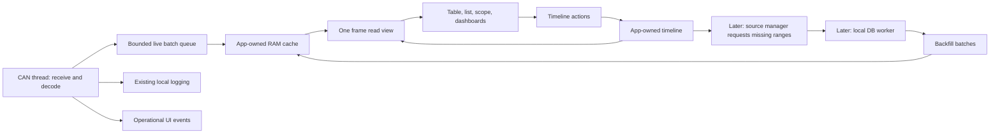

# DaqApp RAM cache and shared timeline proposal

Status: architecture proposal, before implementation.

## Goal and scope

`DAQ_Master_Plan.drawio` describes a transition from widget-owned live data to
widgets rendering a shared RAM cache at shared start/end/setpoint times. Live
CAN traffic must reach that cache without waiting for SQLite, cloud sync, or
log conversion. Later, source management fills the same cache from local
SQLite; cloud downloads and offline Parquet imports populate SQLite.

The first implementation should establish that shared data model and migrate
the CAN table, CAN list, and scope. SQLite, cloud sync, and Parquet ingestion
are later steps. Define their integration boundary now without implementing
their services.

## Current implementation

- `src/can/thread.rs::process_can_frame` timestamps classic CAN frames with
  `chrono::Local::now()`, decodes them, and sends parsed/unparsed messages over
  an unbounded standard-library channel. HIL processes decoded messages here.
- `src/app.rs::update` drains that channel into a frame-local vector.
- `src/workspace.rs` passes that vector through `WidgetContext`.
  `src/widgets.rs::Widget::show` delivers it to each rendered widget. Data
  ingestion consequently depends on rendering; hidden panes can miss traffic.
- The table stores latest decoded/unparsed messages, the list keeps a bounded
  deque, and the scope keeps its own signal window and relative time origin.
  Table/list freeze clones their data through `Frozen<T>`; scope pause stops
  accepting samples. These are different pause semantics.
- Other dashboards and jitter also derive state from arriving messages.
  Bootloader, HIL, transmission status, and connection status use the same
  event channel but have operational responsibilities beyond visualization.
- `Driver::read_frames` returns bare SLCAN frames. UDP parsing discards the
  device ticks and bus bit, and infers standard/extended identity from numeric
  ID size instead of the explicit flag. Parsed/unparsed UI messages have no
  bus/session identity; unparsed messages also lose the extended-ID flag.
- Local logging generates its own elapsed ticks. A future live/log merge needs
  explicit clock mapping and identity; timestamps alone cannot identify a frame.

## Ownership and data flow



Keep cache mutation on the UI thread initially, as drawn. CAN sends directly
to cache ingestion through a dedicated queue; the app applies batches before
rendering. There is no database round trip and no widget delivery step.
This is direct live ingestion, although visibility still occurs at UI frame
cadence. A shared lock-based cache is unnecessary unless measurements show
this ingestion path is insufficient.

Drain within a work budget so a sustained producer cannot indefinitely delay
rendering. Bound queue memory as well as cache memory. The CAN thread must not
block on a full visualization queue: preserve logging/HIL processing, record
overflow, and surface a coverage gap. Later persistence can repair that gap.
Until then, make the missing data visible. Measure batch latency, queue depth,
dropped frames, cache bytes, and query/render duration before tuning limits.

All widgets in one frame see the same cache revision and resolved timeline.
Apply widget timeline actions after rendering so a scope click affects every
widget together on the next frame. Operational events stay separate and do
not rewind when the user scrubs; HIL and firmware workflows remain live.

## Timeline semantics

The user's start/end/setpoint model is the right public model. Separate it
from cache residency and source availability:

| Concept | Meaning |
| --- | --- |
| Requested range | The shared interval the user wants to view |
| Resolved start/end | The interval used by widgets this frame |
| Setpoint | Shared cursor within that interval |
| Resident coverage | Intervals actually loaded, including known empty intervals |
| Available range | What a source says could be loaded; later source metadata |
| Live head | Latest normalized sample time in the selected session |

First/last sample timestamps do not establish complete coverage. An interval
may contain no traffic, or may have an unloaded hole. Track loaded, pending,
missing, and failed intervals independently of samples. Until persistence is
available, distinguish retained live history from evicted/unrecoverable history.

Prefer explicit policies over three independently marching booleans:

```rust
enum RangePolicy {
    Fixed { start: Time, end: Time },
    Rolling { width: Duration }, // end follows live head; start = end - width
    Growing { start: Time },     // fixed start; end follows live head
}
enum CursorPolicy {
    FollowEnd,
    Fixed(Time),
}
```

`Time` is an integer session-relative time, preferably microseconds. Keep an
optional UTC anchor for labels and cross-source correlation. Never compare
unmapped device ticks to host wall-clock timestamps. Preserve source ticks,
receive time, and timestamp provenance in ingestion metadata. For the initial
serial/loopback sources, normalize a session monotonic receive clock. UDP needs
tick wrap/restart handling and a clock mapping; uncertain alignment stays
explicit. Convert to floating-point seconds only at the plot boundary.

Live defaults to `Rolling` + `FollowEnd`. Scrubbing makes the cursor fixed;
the range may continue rolling. A global Pause freezes both resolved range
and cursor while capture continues. Resume Live restores rolling/follow.
This covers the useful marching combinations without permitting start to
overtake end. Growing mode is optional for the first UI.

Enforce `start <= setpoint <= end` through timeline actions. If a rolling
range moves beyond a fixed cursor, freeze the range at its last valid position
rather than silently moving the cursor. With no samples, render an explicit
empty state. Disconnection holds the last live head; it does not erase history.
Source/session changes require explicit selection and never mix unrelated runs.

## Cache structure and query contract

Use one immutable frame record, indexed in two ways:

```text
MessageKey = (session, bus, numeric_can_id, standard_or_extended)
SampleOrder = (normalized_time, stable_frame_id)

FrameRecord = {
    stable_frame_id, message_key, normalized_time, timestamp_provenance,
    frame_kind, payload_length, raw_payload,
    decoded: optional { schema_revision, signal_values }
}

by_message: HashMap<MessageKey, VecDeque<Arc<FrameRecord>>>
raw_order:  VecDeque<Arc<FrameRecord>>
coverage:  interval metadata
revision:  monotonically increasing cache revision
```

The hash map can be nested by bus as suggested, or flattened into `MessageKey`.
The important properties are bus/ID separation and a history per message.
Both indexes reference the same payload; the raw ring contains decoded and
unparsed traffic. Signals should refer to shared schema definitions, ideally
through compact IDs and value arrays, rather than cloning names/definitions
and another string hash map for every frame. Initially existing decoded types
can be wrapped behind the cache API to keep migration manageable.

Keep both indexes sorted by `SampleOrder`. Live in-order traffic appends in
constant time; rare late inserts may move deque elements. Backfill batches
are sorted and merged, not appended. Use stable source frame IDs for overlap
deduplication. Identical timestamp/ID/payload can be legitimate repeated frames
and must not be collapsed. Durable cross-source IDs require a later ingestion
contract; where IDs cannot be matched, report overlap uncertainty.

A deque is a reasonable first implementation, not a commitment to arbitrary
large-history insertion costs. Hide storage behind queries so sorted chunks
can replace it if backfill profiling warrants that. Avoid mutable numeric deque
positions as cross-index references: front eviction invalidates them.

Suggested read API (conceptual, not final Rust signatures):

```text
latest_message(key, start, setpoint) -> optional frame + coverage status
latest_signal(key, signal, start, setpoint) -> optional sample + coverage status
signal_range(key, signal, start, end) -> ordered samples + coverage status
recent_frames(filters, start, setpoint, limit) -> ordered frames + coverage status
```

For widget reads use inclusive bounds `[start, end]` and `timestamp <= setpoint`.
Resolve equal timestamps by stable frame order. Internal loading intervals can
use half-open bounds if conversion is consistent.

Honor the requested table semantics: latest message within `[start, setpoint]`.
A message last seen before start is unknown in that view, even if resident.
If a future mode needs carried-forward state, expose that as a separate query
and load predecessor samples explicitly. Multiplexed signals need their own
latest-present lookup: the latest frame may not contain the requested signal.

Use one current message result per key, with optional decoding, so an unparsed
newer frame cannot accidentally leave an older decoded frame appearing current.
DBC changes must not reinterpret existing values silently. Tag decoded data
with a schema revision; initial implementation starts a new decoding generation
and makes old schema ownership explicit. Later re-decoding raw history is a
cache/source operation, not a widget operation.

## Widget behavior

| Widget | Shared-cache behavior |
| --- | --- |
| CAN table | Latest frame per key within start through setpoint; show timestamp/age and decoding status |
| CAN list | Most recent X matching frames within start through setpoint, using the raw index |
| Scope | Signal samples across start through end; cursor line and highlight latest present sample at/before setpoint |
| Dashboards | Values queried at setpoint; derived values recomputed for that time |
| GPS/G-G/jitter | Time-bounded projections with defined lookback and coverage requirements |

Scope click emits a shared `Seek(time)` action. All plots use the same time
origin. Decimation is a rendering projection, not acquisition-time data loss;
the cursor highlight queries the underlying samples even if decimation omits it.
Scope export selects an explicit interval from the cache.

Widgets retain selection, formatting, filters, pan/zoom, and disposable derived
render buffers. Such buffers must be keyed by cache revision, timeline, and
configuration, and work after backward seeks and backfill. They cannot be the
authoritative CAN history. New or previously hidden widgets immediately query
retained history. Existing per-widget freeze controls should become shared
timeline controls. Clear should reset a widget filter/view or explicitly start
a new capture; it should not casually erase everyone else's cache.

## Residency, backfill, and memory

Set both a retention duration and a total memory budget. Eviction removes a
frame from every index and updates coverage, releasing payload ownership once
no frame view references it. Include indexes, decoded allocations, queued
batches, and retained snapshots in budget accounting. Do not build a whole
cache clone per frame: borrow it during rendering and copy only required
render points or small Arc handles.

Pausing does not grant unlimited retention. Protect the selected historical
range within the budget and retain a bounded live tail. If both cannot fit,
report memory pressure and unavailable coverage instead of silently presenting
a complete view. In the first version, evicted history cannot be recovered
automatically; returning live always remains possible.

Later the source manager translates requested ranges into missing-interval
requests. Backfill carries session ID, request generation, schema revision,
coverage outcome, and sorted frames. Discard stale results after a session
change; results from an earlier range can only be retained if still useful and
within budget. An empty successful response marks coverage loaded. A failed
response does not. Large merges must be budgeted or prepared off-thread and
published coherently; widgets never see half-updated indexes/coverage.

## Incremental implementation

1. Add independent `timeline.rs` and `data_cache.rs` modules with policies,
   identity types, queries, bounded retention, and coverage semantics. Test
   them without GUI/driver dependencies.
2. Preserve bus, extended flag, source/session identity, and time metadata in
   a driver receive envelope. Update UDP parsing and keep logging and cache
   timestamp handling consistent. Define DBC generation transitions.
3. Add live cache ingestion before widget rendering and expose an immutable
   frame view through `WidgetContext`. Keep operational events and temporary
   legacy widget delivery until migration is complete.
4. Add shared timeline controls and migrate table/list/scope together. Remove
   their authoritative histories, `Frozen` use, and per-message data handlers.
5. Migrate other telemetry views, including time-aware derived metrics. Remove
   legacy telemetry fanout only when all consumers have replacements.
6. Connect asynchronous local-DB backfill to the existing batch/coverage
   boundary. Add cloud/offline population of the DB independently afterward.

The first reviewable vertical slice is live ingestion plus shared pause/seek
and those three widgets. Validate bus and standard/extended collisions; equal
timestamps; out-of-order inserts; backward seeks; missing/empty coverage;
unparsed newest frames; multiplexed signal lookup; consistent eviction;
queue overflow; capture while paused; schema/session transitions; and newly
opened/hidden widgets. Later add overlap deduplication and stale asynchronous
response tests when persistence supplies stable identities.

Defaults for rolling duration, memory limit, and list count should be chosen
from representative CAN traffic measurements. They are configuration choices,
not architecture prerequisites.
