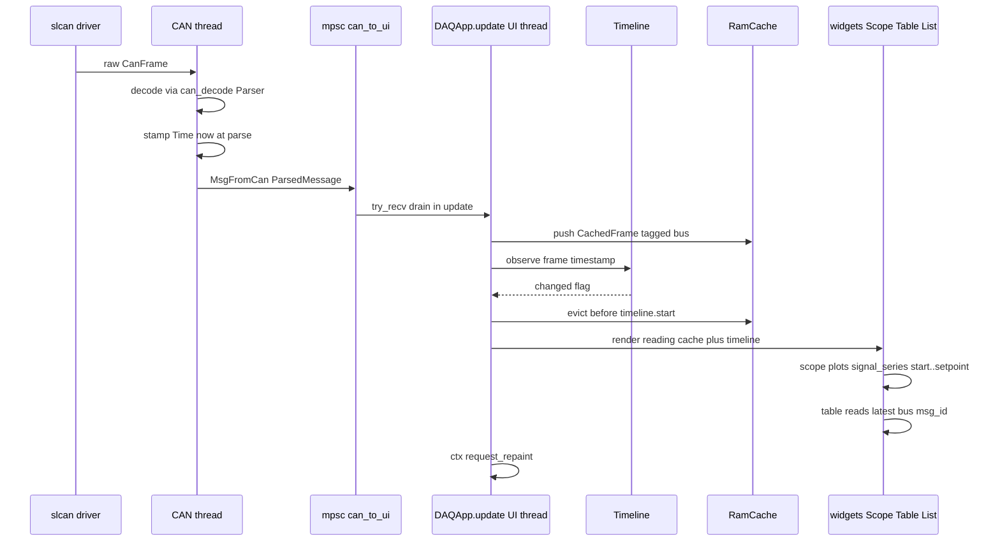

# daqapp — RAM Cache + Timeline Design (v2)

Status: proposal. Scope: `daq/daqapp` only. No firmware or `daqcore` changes except
`daqcore::log_parse` reuse (read-only).

## 1. Goals & Non-Goals

### Goals
- Single **wall-clock** timeline (`start`, `end`, `setpoint`) that drives what every
  data widget shows. Each of the three can be **marching** (auto-advancing) or
  **frozen** (user-controlled) independently.
- One shared **RAM cache** of every received CAN frame, time-ordered, that all
  widgets read from instead of keeping private `VecDeque`/`HashMap` stores.
- Enables scrubbing: freeze the timeline in the past, and every widget renders
  "the world as of `setpoint`" with zero per-widget state duplication.
- A `DataSource` trait so `.log` files (Phase 4) and SQLite (Phase 5) can fill the
  same cache the live path uses.

### Non-Goals
- No per-signal index trees, B-trees, interval trees, or columnar storage.
  Intentionally naive; see the perf caveat in §3.
- No persistence of the RAM cache. `.log`/SQLite are separate sources.
- No changes to the CAN thread's I/O loop, driver, HIL engine, or bootloader.
- No multi-timeline (one global timeline per app; per-widget view sizes allowed).

## 2. Timeline

### 2.1 Time representation — decision: `i64` Unix millis

```rust
// src/data/time.rs
#[derive(Debug, Clone, Copy, PartialEq, Eq, PartialOrd, Ord, Hash)]
pub struct Time(i64); // wall-clock Unix time, milliseconds, UTC

impl Time {
    pub fn now() -> Self;                                    // chrono::Utc::now()
    pub fn from_chrono_local(t: &chrono::DateTime<chrono::Local>) -> Self; // migration shim
    pub fn as_millis(self) -> i64;
    pub fn chrono_utc(self) -> chrono::DateTime<chrono::Utc>;
    pub fn label(self) -> String;                            // "14:32:07.123" local display
    pub fn diff_millis(self, other: Time) -> i64;
}
```

Why `i64` millis instead of `chrono::DateTime<Utc>`:
- Comparison, subtraction, `+`/`-`, and `Hash` are free on an integer; `DateTime`
  arithmetic allocates and carries tz-naive subtleties.
- The cache sorts/evicts by time on the hot path (up to ~5k frames/s); cheaper is better.
- It is still **real wall-clock UTC**, satisfying the constraint (not "time since
  connect"). `label()` renders local time via chrono when a human-facing string is
  needed, so widgets lose nothing.
- `Time::now()` is called at parse time in the CAN thread (the "corrected"
  timestamp); the cache stores exactly that value.

### 2.2 Fields and marching state

```rust
// src/data/timeline.rs
#[derive(Debug, Clone, Copy, PartialEq, Eq)]
pub enum Track { Marching, Frozen }

pub struct Timeline {
    start: Time,
    end: Time,
    setpoint: Time,
    start_track: Track,
    end_track: Track,
    setpoint_track: Track,
    window_secs: f64,        // used when start is Marching: start = end - window
    follow_offset_secs: f64, // used when end is Marching: end = latest + offset
}
```

Semantics of each track when `Marching` (auto-advance rule, applied in `observe`):

| Field    | Marching behavior                                          | Frozen behavior            |
|----------|------------------------------------------------------------|----------------------------|
| `end`    | `end = max(end, latest + follow_offset)` (default offset 0) — the live right edge | pinned to user value       |
| `start`  | `start = end - window_secs` (default window 10.0) — keeps a constant span behind `end` | pinned to user value       |
| `setpoint` | `setpoint = end` — the "live cursor" rides the right edge | pinned; this is scrubbing  |

Independent-frozen combinations and what they mean:
- all Marching = live-follow (today's behavior).
- `setpoint` frozen, others Marching = "pause at a moment in the past"; live data
  keeps filling the cache, plots stay put. **This replaces `Frozen<T>` pause.**
- `end` frozen, `start` Marching = fixed right edge, constant window.
- `start` frozen, `end` Marching = growing window from a fixed past anchor.

### 2.3 Public API

```rust
impl Timeline {
    pub fn live(now: Time, window_secs: f64) -> Self; // all Marching, end = setpoint = now

    /// Feed a newly observed frame timestamp. Advances all Marching tracks.
    /// Returns true if any visible field changed (caller may request_repaint).
    pub fn observe(&mut self, latest: Time) -> bool;

    pub fn start(&self) -> Time;
    pub fn end(&self) -> Time;
    pub fn setpoint(&self) -> Time;
    pub fn start_track(&self) -> Track;
    pub fn end_track(&self) -> Track;
    pub fn setpoint_track(&self) -> Track;
    pub fn is_live(&self) -> bool; // setpoint is Marching

    /// Freeze a field at an absolute time (clamped per invariants below).
    pub fn set_start(&mut self, t: Time);
    pub fn set_end(&mut self, t: Time);
    pub fn set_setpoint(&mut self, t: Time);

    /// Return a field to Marching.
    pub fn release_start(&mut self);
    pub fn release_end(&mut self);
    pub fn release_setpoint(&mut self); // the "Go live" button

    pub fn set_window_secs(&mut self, secs: f64);
    pub fn set_follow_offset_secs(&mut self, secs: f64);

    pub fn range(&self) -> std::ops::Range<Time>;          // start..end (plot extent)
    pub fn setpoint_range(&self) -> std::ops::Range<Time>; // start..setpoint (render extent)
}
```

### 2.4 Invariants (enforced by clamping inside setters/observe)
1. `start <= end`. If a frozen `start` exceeds a new `end`, clamp `end` to `start`
   (never silently move a frozen field).
2. `setpoint <= end`. A marching `setpoint` equals `end` by construction; a frozen
   `setpoint` is clamped to `min(setpoint, end)`.
3. `start <= setpoint`. If a frozen `start` moves past a frozen `setpoint`, clamp
   the `setpoint` down to `start`.
4. A Marching field always satisfies the invariants re-derived after each `observe`.

### 2.5 Repaint triggering
`Timeline` lives on `DAQApp` (UI thread). `update()` calls `observe()` during the
`MsgFromCan` drain; widgets read `timeline` fresh every `show()`, and `DAQApp`
already calls `ctx.request_repaint()` unconditionally at frame end — so any
timeline change (live advance or user drag in the timeline bar) is rendered on the
next frame with no extra wiring. The timeline bar UI is an `egui::Slider`/drag
area per field, writing via `set_*`/`release_*`, and toggles showing per-field
Marching/Frozen state.

## 3. RAM Cache (intentionally naive)

### 3.1 Types

```rust
// src/data/cache.rs
use crate::{connection, data::Time};

#[derive(Debug, Clone)]
pub struct CachedFrame {
    pub timestamp: Time,
    pub bus: connection::CanBus, // tag applied at ingest from DAQApp::can_bus
    pub msg_id: u32,             // without the extended-ID flag
    pub payload: FramePayload,
}

#[derive(Debug, Clone)]
pub enum FramePayload {
    Decoded { raw_bytes: Vec<u8>, decoded: can_decode::DecodedMessage },
    Undecoded { raw_bytes: Vec<u8> },
}

const CAPACITY: usize = 500_000; // hard frame ceiling; oldest dropped first

pub struct RamCache {
    frames: VecDeque<CachedFrame>,                                 // time-ordered, oldest first
    latest: hashbrown::HashMap<(connection::CanBus, u32), CachedFrame>,
}
```

Two structures, nothing else:
- `frames`: one time-ordered `VecDeque` of **all** frames (the "little naive" core).
- `latest`: a `hashbrown` side index of the most recent frame per `(bus, msg_id)`
  for O(1) "current value" reads (table, battery).

Requires a one-line change: add `Hash` to the `#[derive(...)]` on
[`connection::CanBus`](daq/daqapp/src/connection.rs:49) (it already has `Copy, Clone,
PartialEq, Eq, Debug`). Note: the task background mentioned `is_bus_1: bool`; the
actual code uses the `CanBus { Vcan, Scan }` enum, which is the correct key.

### 3.2 API

```rust
impl RamCache {
    pub fn new() -> Self;
    pub fn clear(&mut self);
    pub fn len(&self) -> usize;
    pub fn is_empty(&self) -> bool;

    /// Append one frame (keeps deque time-ordered), refresh `latest`.
    pub fn push(&mut self, frame: CachedFrame);
    /// Backfill path: append many, single `latest` refresh pass.
    pub fn push_batch(&mut self, frames: impl IntoIterator<Item = CachedFrame>);

    /// Drop frames older than `start`, then drop oldest until len <= CAPACITY.
    pub fn evict(&mut self, start: Time);

    pub fn time_span(&self) -> Option<std::ops::Range<Time>>;
    pub fn latest(&self, bus: connection::CanBus, msg_id: u32) -> Option<&CachedFrame>;

    /// Frames with start <= timestamp < end. Linear scan for now (see 3.4);
    /// the deque is sorted, so the hot start bound can become
    /// `VecDeque::partition_point` (a method — no new field) when profiling asks.
    pub fn frames_in_range(
        &self,
        range: std::ops::Range<Time>,
    ) -> std::vec::Vec<&CachedFrame>;

    /// Up to `count` most recent frames with timestamp <= ts.
    pub fn frames_before(&self, ts: Time, count: usize) -> std::vec::Vec<&CachedFrame>;

    /// All physical values for one signal within a range, in time order.
    /// `signal` is matched by name inside DecodedMessage.signals.
    pub fn signal_series(
        &self,
        bus: connection::CanBus,
        msg_id: u32,
        signal: &str,
        range: std::ops::Range<Time>,
    ) -> Vec<(Time, f64)>;
}
```

Returning `Vec<&CachedFrame>` (not a lifetime-bound iterator) keeps call sites
trivial for widgets; the clones avoided, only references copied.

### 3.3 Memory estimate
Per frame: `Time` 8 B + `CanBus` 1 B + `msg_id` 4 B + payload enum/vec headers ~24 B
+ `raw_bytes` 8–64 B + `DecodedMessage` ~100–300 B (signal count dependent) ≈
**~250 B average**. Typical load (50–200 msg/s, 10 s marching window) holds only
a few thousand frames (~1 MB). Worst case (1 h window at 200 msg/s → 720k frames)
hits `CAPACITY` → bounded at **500k × 250 B ≈ 120 MB**. Acceptable for a desktop
engineering tool; the hard cap makes the ceiling explicit.

### 3.4 Perf caveat (noted, then moved on)
`frames_in_range`/`signal_series` are O(n) over the deque. At 500k frames a full
window rescan of one signal is a few milliseconds — fine at 60 FPS for a handful of
widgets, but scrubbing through a dense backfill with many Scope widgets open could
stutter.

**Upgrade path — no new field needed.** `partition_point` is a method on
`VecDeque` itself (stable since Rust 1.52): because `frames` is time-sorted,
`self.frames.partition_point(|f| f.timestamp < range.start)` gives the start
index in O(log n); a second call with the reversed predicate gives the end
index. The fix is therefore a **method-body change inside `RamCache` only** —
same struct, same fields, same API — turning the hot path into O(log n + k)
where k is the result count. We ship the linear version first and take that
two-line upgrade when profiling asks.

## 4. Threading & Sync

### 4.1 Decision: UI thread owns the cache and timeline (recommended)

Presented options:

| Option | Description | Verdict |
|--------|-------------|---------|
| A. UI-thread ownership | CAN thread keeps sending `MsgFromCan` over the existing mpsc; `DAQApp` appends to `RamCache` + calls `Timeline::observe` while draining `can_to_ui_rx` in `update()` | **Chosen** |
| B. Shared memory | CAN thread pushes directly into `Arc<Mutex<RamCache>>` / `Arc<RwLock<...>>` | Rejected |

Why A:
- The mpsc already exists and is the only synchronization point today; A adds zero
  new synchronization primitives and keeps the CAN thread's hot loop lock-free.
- egui is single-threaded by contract; every consumer (widgets) is already on the
  UI thread, so there is nothing to protect.
- B would take a lock up to ~5k times/s in the CAN loop and still race with the UI
  reading mid-frame; it buys nothing because no off-UI-thread reader exists in the
  live path.

### 4.2 Where each thing happens
- **Ingest**: in [`DAQApp::update`](daq/daqapp/src/app.rs:216), for each drained
  `MsgFromCan::ParsedMessage(p)` / `UnparsedMessage(u)`, build a `CachedFrame`
  (tag `bus = self.can_bus`) and `self.cache.push(frame)`.
- **Advance**: `let changed = self.timeline.observe(frame.timestamp);`
- **Evict**: once per `update()` after the drain:
  `self.cache.evict(self.timeline.start());`
- **Connect/Disconnect**: on `MsgFromCan::Disconnection` → `cache.clear()` +
  `timeline = Timeline::live(Time::now(), 10.0)`. On `ConnectionSuccessful` →
  nothing (next frame re-anchors).
- **Backfill worker** (Phase 4+): a worker thread parses a file and ships
  `Vec<CachedFrame>` chunks over its own `mpsc::Sender<Vec<CachedFrame>>` which the
  UI drains in `update()` into `cache.push_batch`. The cache always has exactly one
  owner: the UI thread. No `Arc`, no `Mutex`, anywhere.

## 5. Fast Path Flow (live CAN frame → pixels)



Cost per frame on the UI thread: one `VecDeque` push, one HashMap insert, a few
comparisons. No allocation beyond what `ParsedMessage` already carries.

## 6. Widget Migration Table

Legend: "range" = `timeline.setpoint_range()`. `bus` = `app.can_bus`.

| Widget | Current store | New read path |
|--------|---------------|---------------|
| Scope [`ui/scope.rs`](daq/daqapp/src/ui/scope.rs) | `window: VecDeque<(f64, f64)>` of relative seconds, `reference_time`, `is_paused`, decimation | `cache.signal_series(bus, msg_id, signal, range)`; keep `window_duration_seconds` as a local view size; `is_paused` → freeze `timeline.setpoint` (pause) / release it (unpause). Drop `add_point`, `reference_time`, decimation counter (decimation computed at render from point count vs pixels) |
| ViewerTable [`ui/viewer_table.rs`](daq/daqapp/src/ui/viewer_table.rs) | `Frozen<DecodedMsgMap>` + `Frozen<UndecodedMsgMap>` (latest-per-id) | `cache.latest(bus, id)` over the DBC message id list; `clean_undecoded` logic replaced by reading only `FramePayload::Decoded`. `paused` → freeze timeline `setpoint` |
| ViewerList [`ui/viewer_list.rs`](daq/daqapp/src/ui/viewer_list.rs) | `Frozen<MsgList>`, 200-item `VecDeque`, `make_space_for_new_message` | `cache.frames_before(timeline.setpoint(), 200)` reversed for display. `paused` → freeze `setpoint` |
| GgPlot [`ui/gg_plot.rs`](daq/daqapp/src/ui/gg_plot.rs) | `points_g: VecDeque<(DateTime<Local>, f32, f32)>`, 5 min | `cache.signal_series` for both signals over `setpoint - 5min .. setpoint` |
| GpsPlot [`ui/gps_plot.rs`](daq/daqapp/src/ui/gps_plot.rs) | `trail: VecDeque<(DateTime<Local>, Position)>` | `frames_in_range` over the GPS msg_id, decode lat/lon at render |
| Dynamics [`ui/dynamics.rs`](daq/daqapp/src/ui/dynamics.rs) | local aggregates over recent frames | recompute from `frames_in_range(range)` each render (cheap at this window size) |
| Jitter [`ui/jitter.rs`](daq/daqapp/src/ui/jitter.rs) | per-id arrival-time tracking | inter-arrival deltas computed from `frames_in_range` filtered to msg_id |
| BatteryVoltage [`ui/battery/battery_voltage.rs`](daq/daqapp/src/ui/battery/battery_voltage.rs) | `modules: Vec<Vec<CellVoltage>>`, `charging_telemetry` (latest state) | `cache.latest(bus, id)` for the cell/pack messages, decode at render |
| BatteryTemps [`ui/battery/battery_temps.rs`](daq/daqapp/src/ui/battery/battery_temps.rs) | latest-state struct | same pattern as BatteryVoltage |
| BusLoad [`ui/bus_load.rs`](daq/daqapp/src/ui/bus_load.rs) | `window: VecDeque<(f64, f64)>` of load samples | **Stays local**: `MsgFromCan::BusLoad` is UI-thread telemetry, not a CAN frame — not in the frame cache. Keep its small ring, display as-is |
| LogParser / SendUi / Bootloader / Hil / CommandPalette | no data store | unchanged |

Detail on the three primary widgets:
- **Scope**: today `add_point` is called per matching `MsgFromCan` and stores
  relative seconds. New: no per-message bookkeeping at all; `show()` computes
  `signal_series` over `timeline.setpoint_range()` (intersected with the local
  `window_duration_seconds` around `setpoint`). Pause = `timeline.set_setpoint(current)`.
- **ViewerTable**: today it keeps two `Frozen` HashMaps and reconciles
  decoded/undecoded. New: the `latest` index already answers "latest per id"; the
  decoded/undecoded distinction falls out of `FramePayload` — no reconciliation pass.
- **ViewerList**: today it self-evicts at 200. New: `frames_before(setpoint, 200)`
  gives the same list, and scrubbing the setpoint automatically re-slices it.

## 7. Backfill Interface

```rust
// src/data/source.rs
pub trait FrameSink {
    fn push(&mut self, frame: CachedFrame);
}
impl FrameSink for RamCache { /* push */ }

/// Fill `sink` with frames whose wall-clock timestamp lies in `range`.
pub trait DataSource {
    fn fill(&self, range: std::ops::Range<Time>, sink: &mut dyn FrameSink) -> std::io::Result<()>;
}

pub struct LogFileSource { pub path: std::path::PathBuf }
// impl DataSource for LogFileSource:
//   reuse daqcore::log_parse (parse.rs + correlate.rs) to read the binary .log,
//   convert each entry's timestamp to Time, tag bus per the file's channel,
//   downsample if denser than ~1 frame / 1 ms per msg_id (memory bound, see 3.4).

// pub struct SqliteSource { pub path: ... }  // Phase 5, same trait.
```

Worker plumbing (UI keeps ownership):

```rust
// src/data/backfill.rs
pub fn start_backfill(
    source: Box<dyn DataSource + Send>,
    range: std::ops::Range<Time>,
) -> (std::sync::mpsc::Receiver<Vec<CachedFrame>>, std::thread::JoinHandle<()>);
```

Worker: `source.fill(range, &mut LocalBuffer)` in ~10k-frame chunks →
`tx.send(chunk)`. UI drains `backfill_rx` in `update()` → `cache.push_batch(chunk)`
+ `cache.evict` + (optionally) `timeline.observe(max_ts)` per chunk so the
timeline live-updates while the load progresses. A `MsgFromUi`-style cancel flag
(`Arc<AtomicBool>`) lets the user abort.

**Constraint**: backfill is only offered while `connection_status == Disconnected`
(keeps the "cache holds exactly one era of data" invariant trivial; see §10 Q3).

## 8. Integration — files touched

| File | Change |
|------|--------|
| `daq/daqapp/src/data/mod.rs` | **new** — `pub mod time, timeline, cache, source, backfill;` |
| `daq/daqapp/src/data/time.rs` | **new** — `Time` (§2.1) |
| `daq/daqapp/src/data/timeline.rs` | **new** — `Timeline`, `Track` (§2) |
| `daq/daqapp/src/data/cache.rs` | **new** — `RamCache`, `CachedFrame`, `FramePayload` (§3) |
| `daq/daqapp/src/data/source.rs` | **new** — `DataSource`, `FrameSink`, `LogFileSource` (§7) |
| `daq/daqapp/src/data/backfill.rs` | **new** — `start_backfill` worker (§7) |
| [`messages.rs`](daq/daqapp/src/messages.rs) | `ParsedMessage.timestamp`, `UnparsedMessage.timestamp`, `MessageSent.timestamp`: `chrono::DateTime<chrono::Local>` → `data::Time` |
| [`can/thread.rs`](daq/daqapp/src/can/thread.rs:38) | `let timestamp = chrono::Local::now();` → `let timestamp = Time::now();` |
| [`connection.rs`](daq/daqapp/src/connection.rs:49) | add `Hash` to `CanBus` derives |
| [`app.rs`](daq/daqapp/src/app.rs:36) | `DAQApp` gains `cache: RamCache`, `timeline: Timeline`, optional `backfill_rx`; `update()` ingest/observe/evict per §4.2; disconnect handling clears both |
| [`widgets.rs`](daq/daqapp/src/widgets.rs:21) | `WidgetContext` gains `cache: &RamCache`, `timeline: &Timeline`; `handle_can_message` shrinks to connection-status/HIL side effects (data path moves to render-time reads); `received_new_data` repaint logic unchanged |
| [`workspace.rs`](daq/daqapp/src/workspace.rs:34) | build `WidgetContext` with the two new fields |
| `ui/scope.rs`, `ui/viewer_table.rs`, `ui/viewer_list.rs`, `ui/gg_plot.rs`, `ui/gps_plot.rs`, `ui/dynamics.rs`, `ui/jitter.rs`, `ui/battery/*` | migrate per §6 |
| [`frozen.rs`](daq/daqapp/src/frozen.rs) | **deleted** once Phase 3 completes (pause = timeline freeze) |
| timeline bar UI | **new** small widget (top of workspace) — 3 fields × slider/drag + Marching/Frozen toggle + "Go live" button |

Nothing is added to the CAN→UI mpsc protocol (`MsgFromCan` unchanged apart from the
timestamp type). The backfill channel is separate.

## 9. Phased Plan

**Phase 1 — Foundation + live fast path + Scope**
- Build `data::{time, timeline, cache}`; wire ingest/observe/evict in `update()`.
- Timeline bar UI (3 sliders, toggles, Go live).
- Migrate Scope; delete its private window/`is_paused` path.
- Exit: live-follow identical to today; freezing `setpoint` freezes Scope;
  scrubbing `start`/`end` rescales the plot; zero per-frame allocations new vs today.

**Phase 2 — ViewerTable + ViewerList + Battery**
- Migrate table (`latest` index), list (`frames_before`), battery voltage/temps.
- Exit: pause in table/list == frozen setpoint; undecoded-reconciliation code
  deleted; battery renders from `latest`.

**Phase 3 — Remaining widgets, delete `Frozen`**
- Migrate GgPlot, GpsPlot, Dynamics, Jitter. Retire `frozen.rs` and all `Frozen`
  uses. BusLoad confirmed to stay local.
- Exit: `rg Frozen daq/daqapp/src` → 0 hits; all 14 widgets render from cache+timeline
  or are declared non-data widgets.

**Phase 4 — `.log` backfill**
- `LogFileSource` over `daqcore::log_parse`; backfill worker + progress UI;
  backfill only while disconnected.
- Exit: load a 10-min `.log`, scrub across it in Scope/table/list; worker abortable;
  memory stays under the §3.3 ceiling.

**Phase 5 — SQLite + Data Source Management**
- `SqliteSource`; sidebar "Data Sources" list (live, `.log` files, sqlite DBs) with
  attach/detach; export current `timeline.range()` to `.log`.
- Exit: a sqlite session shows in every Phase-3 widget identically to a `.log` session.

## 10. Open Questions (with recommendations)

### Settled
1. **`Time` as `i64` millis vs `chrono::DateTime<Utc>` end-to-end?** — *Decided:*
   `i64` millis newtype (§2.1); chrono only at the edges. Same shape if we ever
   move to micros.
2. **One global timeline vs per-widget timelines?** — *Decided:* one global
   `Timeline` on `DAQApp`; widgets keep only local view *sizes*. A single scrubber
   across all widgets is the core product value. "Two eras at once" is two app
   instances, not two timelines.

### Still open
3. **Backfill while connected: merge into live cache or forbid?**
   *Recommendation:* forbid (backfill only when `Disconnected`; disconnect clears
   the cache). Merging two timestamp eras complicates eviction, the `latest`
   index, and invariants for a rare workflow. Phase 5's Data Source list can
   offer "open a second window" if demand appears.

4. **`frames_in_range` linear scan now vs binary search from day one?**
   *Recommendation:* linear now; the fix is a method-body change on the existing
   `VecDeque` field (§3.4) with no schema change, so deferring it costs nothing.
