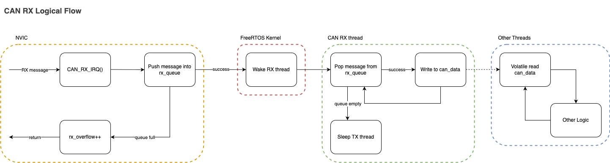
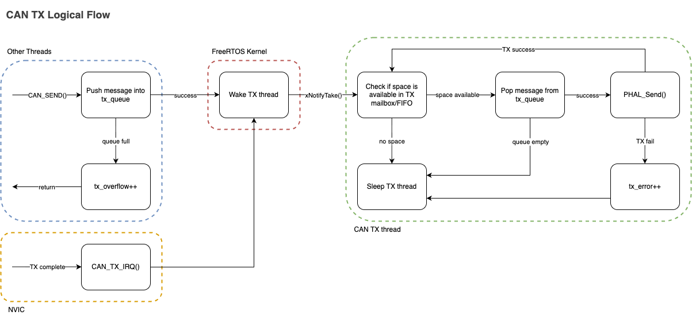
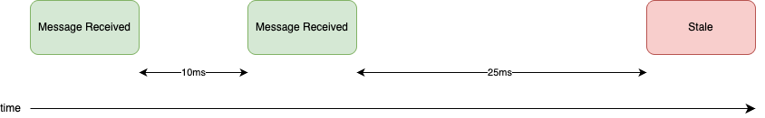
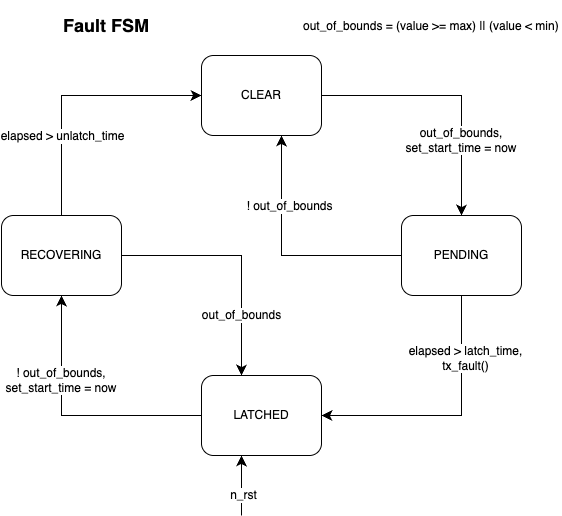

# PER CAN Library
Standardized framework for CAN communication and system-wide fault management within PER vehicles.

- `firmware/generators/`: Python generation pipeline for CAN and fault artifacts.
- `firmware/can_library/generated/`: Auto-generated C files and headers.
- `firmware/can_library/dbc/`: Generated CAN database files.

**Core Files:**
- [`can_init.c`](../../firmware/can_library/source/can_init.c) / [`can_common.h`](../../firmware/can_library/can_common.h): Bus/peripheral initialization and `CAN_init()`.
- [`can_rx.c`](../../firmware/can_library/source/can_rx.c): CAN RX task and the shared `can_data` instance.
- [`can_tx.c`](../../firmware/can_library/source/can_tx.c): CAN TX task and per-peripheral software queues.
- [`faults_common.c`](../../firmware/can_library/source/faults_common.c) / [`faults_common.h`](../../firmware/can_library/faults_common.h): System-wide fault management.
- [`can_codec.h`](../../firmware/can_library/can_codec.h): Signal packing and unpacking helpers.
- `firmware/cmake/can_library.cmake`: CMake integration and node library generation.

## Logic
The high-level logic flow of an RX is shown here:

> [!NOTE]
> The all RX IRQs push to the same queue rather than having separate queues per peripheral.

The high-level logic flow of a TX is shown here:

> [!NOTE]
> The actual implementation of the CAN TX task manages up to 3 separate hardware peripherals at once, each with its own software queue.

## Stale Detection
Periodic CAN messages are assigned a deadline of 2.5x their expected period. If a message is not received within the window, it's associated data is no longer valid.

## Usage
1. Define your CAN network and global faults in `firmware/generators/configs/`; the generator validates them with its Pydantic configuration models.
    1. Use FDCAN peripherals on G4 and CAN peripherals on F4.
2. Add `can_node_<NODE_NAME>` to `LIBS` in your board's `add_firmware_component(...)` call (must match the uppercase node name from CMake).
3. Include the generated header for your node (e.g. `#include "can_library/generated/PDU.h"` / `#include "can_library/generated/<NODE_NAME>.h"`) in your `main.c`.
4. Initialize the CAN library in your `main.c` with `CAN_init()`.
5. Setup CAN tasks in your `main.c` using `DEFINE_CAN_TASKS()` and `START_CAN_TASKS()`.

The most recent rx'd data is available in the `can_data` struct, which is updated by the CAN RX task.
Sending CAN messages is done via the generated `CAN_SEND_<message_name>()` functions, which enqueue messages to be sent by the CAN TX task.

## Fault System
The `faults_common` module implements the **FIDR (Fault Isolation, Detection, and Recovery)** system. It manages the lifecycle of system-wide faults using a robust Finite State Machine (FSM) to prevent flickering and ensure deterministic fault handling.

### Usage:
- `update_fault(fault_id_t fault_id, float value)`: Called by the owner node to feed sensor/status data into the FSM.
- `fault_library_periodic()`: Tally active faults and call `tx_fault_sync()`, which broadcasts the node-specific `<node>_fault_sync` CAN message.
- `is_latched(fault_id_t fault_id)`: Check if a specific fault is active.
- `is_clear(fault_id_t fault_id)`: Check if a specific fault is clear.

> [!NOTE]
> Each node is assigned a specific range of faults (`MY_FAULT_START` to `MY_FAULT_END`).
> Only the "owner" node can update the state of these faults, ensuring a single source of truth.
