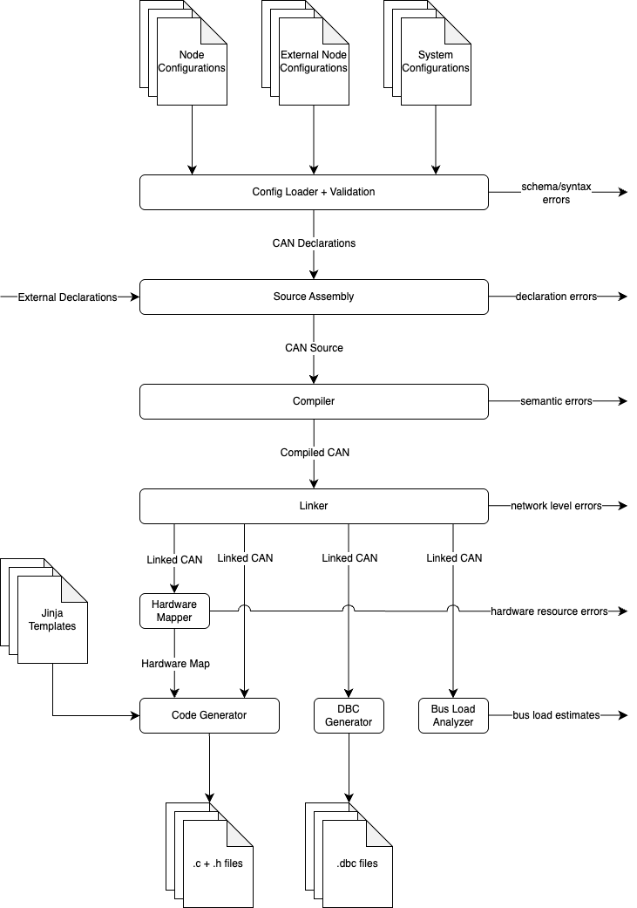

# Firmware generators

The CAN generator is organized as an explicit compiler pipeline:

```text
JSON configs -> ConfigBundle
             -> CanSource      (flat configured and generated declarations)
             -> CanIR          (flat TX placements and RX subscriptions)
             -> LinkedCan      (ordered linked TX records and resolved subscriptions)
             -> render views
             -> Artifacts
```

`CanSource`, `CanIR`, and `LinkedCan` stay flat throughout the pipeline.
Node/bus nesting is rebuilt only in render views for templates that naturally
emit one node or bus at a time.


