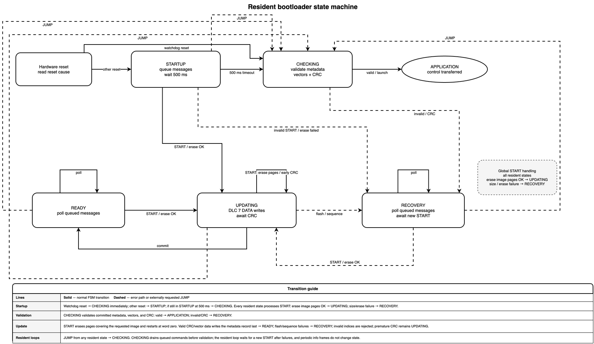

# G4 CAN bootloader

The resident STM32G474RE bootloader receives and validates application images
written directly to the application slot over the transport configured for its
board. Each board has a dedicated image for its CAN IDs, bus, baud rate, and
pin mapping. CRC detects corruption but does not authenticate firmware.

## Architecture


## State machine



| Path | Responsibility |
| --- | --- |
| [`main.c`](main.c) | Boot decision and recovery loop. |
| [`bootloader/`](bootloader/) | Update state machine, flash, CRC, and application hand-off. |
| [`node_defs.h`](node_defs.h) | Per-board single-transport configuration. |
| [`../../common/bootloader/`](../../common/bootloader/) | Shared protocol, metadata, and application reset callback. |

At startup, the bootloader initializes CAN and advertises READY, then polls
for START for a bounded 500 ms startup window. This gives DaqApp time to resend
START after an application reset without delaying normal boot indefinitely. If
startup is still active when the window expires, it validates metadata, vectors,
and CRC before launch. A START that fails size or erase validation enters
recovery; an invalid image remains resident in the CAN loop.

## Update flow

1. DaqApp sends `START`. A bootloader-aware application handles its START
   callback by calling only `NVIC_SystemReset()`; a resident bootloader accepts
   the same frame as an update request.
2. After an application reset, the bootloader advertises READY and DaqApp
   resends `START(image_size)` during the 500 ms startup window. START invalidates
   metadata, erases the complete flash pages covering the requested image, and
   receives indexed words directly in the application slot. If the bootloader
   was already resident, the initial START performs this same operation and
   returns `ACK(size)`.
3. `CRC(expected_crc)` validates the complete application image, its vectors, and
   its CRC before writing metadata as the commit record.
4. `JUMP` validates the committed image again and launches it.

Once START succeeds, an interrupted transfer leaves the metadata record
invalid. A reset during application programming therefore keeps the bootloader
resident; vector and CRC checks also prevent a partial image from launching.

## Protocol

START, CRC, JUMP, DATA, and response IDs come from
[`can_library/configs`](../../can_library/configs/); front and rear driveline use
separate IDs. Each command is a separate CAN message with a four-byte
little-endian argument. DATA uses a 24-bit little-endian word index followed by
four word bytes (DLC 7); resident firmware also accepts the legacy DLC 6 frame
with a 16-bit index.

| Message | Argument | Result |
| --- | --- | --- |
| `START` | Word-aligned image size. | Invalidates metadata, erases the complete flash pages covering the image, and returns `ACK(size)`. |
| `CRC` | Expected CRC. | Validates the application image in place and returns `ACK(calculated_crc)`. |
| `JUMP` | Zero argument. | Launches or returns `ERROR/ADDRESS`. |

| Status | Meaning |
| --- | --- |
| `READY` | Bootloader is listening; detail is the protocol version. |
| `ACK` | Command accepted. |
| `ERROR` | Locked, sequence, flash, size, or address failure. |
| `CRC_ERROR` | Application image CRC mismatch. |

Words must arrive in order. Duplicate accepted indices are ignored; gaps cancel
the transfer. The receive interrupt only queues frames, while `BL_poll()` owns flash and
CRC operations. Its explicit FSM handles the startup handshake without a blocking
wait; no reset-cause flags or RTOS are required.

## Flash validation


The STM32G474RE map reserves 16 KiB for the resident bootloader and 16 KiB for
metadata, followed by the full 480 KiB application slot at `0x08008000`
through `0x0807FFFF`. No flash remains reserved after the application slot.

Before launch, `BL_checkAndBoot()` requires valid metadata, a stack pointer in
SRAM, a Thumb reset handler inside the image, and a matching application CRC.
The package builder, DaqApp, and target use the same word-based STM32 CRC.

## Build

```bash
python3 firmware/build_firmware.py --bootloader
python3 firmware/build_firmware.py --package
```

`--bootloader` builds resident images and relocated applications. `--package`
also builds all six resident bootloader ELF/HEX/BIN images for provisioning;
these are emitted under `output/bootloader_<NODE>/`. The update archive still
contains only the six relocated application payloads, manifest, CRC sidecars,
and application HEX files; DaqApp reads the manifest's binary paths. Flash the
matching resident `bootloader_<NODE>.bin` before using a service package. If
objcopy emits a partial final word, the packaged binary is padded with
erased `0xFF` bytes before its manifest size and CRC are computed.

## Recovery

| Symptom | Check |
| --- | --- |
| No `READY` | Resident image, wiring, board configuration, and command ID. |
| `ERROR/SEQUENCE` | Restart from word zero. |
| `CRC_ERROR` | Compare the target CRC and package image. |
| `ERROR/FLASH` | Power and flash protection. |
| `ERROR/ADDRESS` | Linker layout, metadata, and vectors. |

There is no image authentication or rollback. Keep power stable and retain a
known-good resident bootloader for recovery.
