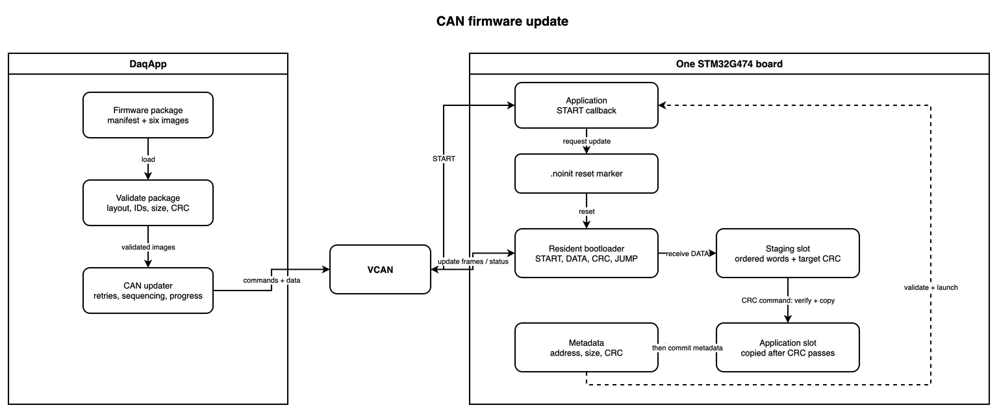
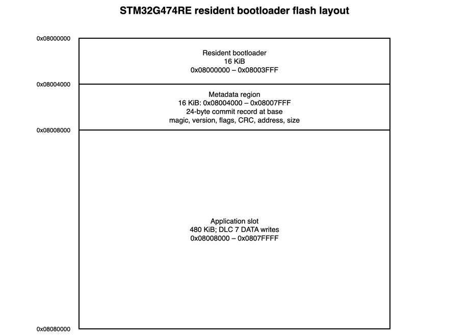

# G4 CAN bootloader

The resident STM32G474RE bootloader receives, validates, and installs
application images over the transport configured for its board. Each board has
a dedicated image for its CAN IDs, bus, baud rate, and pin mapping. CRC detects
corruption but does not authenticate firmware.

## Architecture



| Path | Responsibility |
| --- | --- |
| [`main.c`](main.c) | Boot decision and recovery loop. |
| [`bootloader/`](bootloader/) | Update state machine, flash, CRC, and application hand-off. |
| [`node_defs.h`](node_defs.h) | Per-board single-transport configuration. |
| [`../../common/bootloader/`](../../common/bootloader/) | Shared protocol, metadata, and application reset callback. |

At startup, the bootloader clears the one-shot `.noinit` marker. Unless an
application requested recovery, it validates metadata, vectors, and CRC before
launch. An invalid image or explicit update request enters the CAN loop.

## Update flow

1. DaqApp sends `START`; the application records the update request and resets.
2. The bootloader accepts `START(image_size)`, erases staging, and receives indexed words.
3. `CRC(expected_crc)` validates staging, copies it to the active slot, and writes metadata last.
4. `JUMP` validates the committed image again and launches it.

An interrupted transfer leaves staging uncommitted. A reset during active-slot
copy can invalidate the application, but vector and CRC checks prevent a
partial image from launching.

## Protocol

START, CRC, JUMP, DATA, and response IDs come from
[`can_library/configs`](../../can_library/configs/); front and rear driveline use
separate IDs. Each command is a separate CAN message with a four-byte
little-endian argument; DATA remains a six-byte word frame.

| Message | Argument | Result |
| --- | --- | --- |
| `START` | Word-aligned image size. | Erases staging and returns `ACK(size)`. |
| `CRC` | Expected CRC. | Installs and returns `ACK(calculated_crc)`. |
| `JUMP` | Zero argument. | Launches or returns `ERROR/ADDRESS`. |

| Status | Meaning |
| --- | --- |
| `READY` | Bootloader is listening; detail is the protocol version. |
| `ACK` | Command accepted. |
| `ERROR` | Locked, sequence, flash, size, or address failure. |
| `CRC_ERROR` | Staged image CRC mismatch. |

Words must arrive in order. Duplicate accepted indices are ignored; gaps cancel
the transfer. The receive interrupt only queues frames, while `BL_poll()` owns
flash and CRC operations.

## Flash validation



Before launch, `BL_checkAndBoot()` requires valid metadata, a stack pointer in
SRAM, a Thumb reset handler inside the image, and a matching application CRC.
The package builder, DaqApp, and target use the same word-based STM32 CRC.

## Build

```bash
python3 per_build.py firmware --bootloader
python3 per_build.py firmware --package
```

`--bootloader` builds resident images and relocated applications. `--package`
emits the six application images, manifest, CRC files, and archive. Flash the
matching `bootloader_<NODE>` before using a service package.

## Recovery

| Symptom | Check |
| --- | --- |
| No `READY` | Resident image, wiring, board configuration, and command ID. |
| `ERROR/SEQUENCE` | Restart from word zero. |
| `CRC_ERROR` | Compare the target CRC and package image. |
| `ERROR/FLASH` | Power and flash protection. |
| `ERROR/ADDRESS` | Linker layout, metadata, and vectors. |

There is no image authentication or rollback. Keep power stable and retain a
known-good resident bootloader for recovery.
