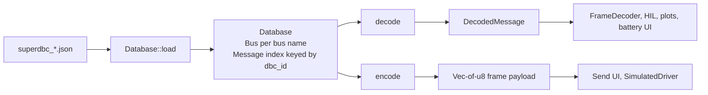

# superdbc — Public API Design (replaces `can_decode` / `can-dbc`)

Design-only spec for a new [`daqcore/src/superdbc/`](daq/daqcore/src/superdbc/mod.rs) module. Goal: strict, version-aware loading of SuperDBC v1.1 JSON (`superdbc_b708877.json`), O(1) hot-path decode/encode with precomputed per-signal extraction, and a metadata surface that covers every current `can_decode`/`can_dbc` usage site in daqcore/daqapp. One new workspace dependency: `sha2` (hoisted to [`[workspace.dependencies]`](daq/Cargo.toml:12)), for the strict `content_hash` (SHA-256) verification.

## 1. Module / file layout

```text
daqcore/src/
  lib.rs              + `pub mod superdbc;` and re-exports of Database, DecodedMessage, Error
  superdbc/
    mod.rs            Public re-exports only (Database, Bus, Message, SignalDefinition,
                      DecodedMessage, DecodedSignalValue, Error, DisplayFormat)
    model.rs          Private serde models mirroring generators/canpiler/superdbc/models.py
                      (strict, deny_unknown_fields) + schema "1.1" gate
    error.rs          superdbc::Error (manual impl std::error::Error)
    database.rs       Database, Bus — load/verify, compile into lookup structures
    message.rs        Message, SignalDefinition, DisplayFormat — compiled metadata
    extract.rs        Bit-extraction core (Intel/Motorola, u/s/float32) + physical math
    decode.rs         Database::decode -> DecodedMessage (O(1) signal index)
    encode.rs         Database::encode / Message::encode
```

The four `can_dbc_*` helpers in [`can.rs`](daq/daqcore/src/can.rs) are deleted; `EXTENDED_ID_FLAG` / `STANDARD_ID_MASK` / `EXTENDED_ID_MASK` stay in [`frame.rs`](daq/daqcore/src/frame.rs:10) / [`can.rs`](daq/daqcore/src/can.rs) since `CanIdentity` already owns that convention.



## 2. Public type signatures

```rust
// superdbc/mod.rs
pub mod error;
pub use database::{Bus, Database};
pub use decode::{DecodedMessage, DecodedSignalValue};
pub use error::Error;
pub use message::{DisplayFormat, Message, SignalDefinition};
```

### 2.1 Error — `error.rs`

Consistent with daqcore's manual-error convention (e.g. [`InvalidCanId`](daq/daqcore/src/frame.rs:10) in `frame.rs`, [`DriverError`](daq/daqcore/src/can/driver.rs:12) in `driver.rs`). No `thiserror`.

```rust
/// Failure to load or use a SuperDBC database.
#[derive(Debug)]
pub enum Error {
    /// File could not be read.
    Io(std::io::Error),
    /// Document is not valid UTF-8/JSON (wraps serde_json::Error).
    InvalidJson(serde_json::error::Error),
    /// `versions.schema_version` is not "1.1" (strict; no migration support yet).
    UnsupportedSchemaVersion(String),
    /// `content_hash` does not match the recomputed SHA-256 of the buses.
    HashMismatch { expected: String, actual: String },
    /// Requested bus name does not exist in the database.
    UnknownBus(String),
    /// A signal definition failed validation (overlapping bits, bad range, non-finite scale).
    InvalidSignal { message: String, signal: String, reason: String },
    /// Encoded value does not map to a representable raw value for the signal.
    EncodeOutOfRange { signal: String, physical: f64, raw_min: i64, raw_max: i64 },
}

impl std::fmt::Display for Error { /* single-line, e.g. "superdbc: hash mismatch ..." */ }
impl std::error::Error for Error {
    fn source(&self) -> Option<&(dyn std::error::Error + 'static)> {
        match self {
            Self::Io(e) => Some(e),
            Self::InvalidJson(e) => Some(e),
            _ => None,
        }
    }
}
impl From<std::io::Error> for Error { /* ... */ }
impl From<serde_json::error::Error> for Error { /* ... */ }
```

### 2.2 Database & Bus — `database.rs`

```rust
/// A fully compiled SuperDBC v1.1 database. Send + Sync; share across threads
/// with `Arc<Database>` (no interior mutability, no locks).
pub struct Database {
    path: std::path::PathBuf,
    content_hash: String,
    buses: Vec<Bus>,                    // preserves JSON insertion order
    message_index: indexmap::IndexMap<u32, MessageRef>, // dbc_id -> (bus_idx, msg_idx)
}

impl Database {
    /// Load and validate a SuperDBC JSON file.
    ///
    /// Steps: read file -> strict parse (unknown fields rejected) ->
    /// `schema_version == "1.1"` -> verify `content_hash` (SHA-256 of the
    /// canonical `{"schema_version", "buses"}` serialization, matching
    /// generators/canpiler/superdbc/generator.py `content_hash`) -> compile
    /// per-signal extraction params and build the `dbc_id` index.
    ///
    /// `dbc_id` is the wire key used elsewhere: standard id as-is,
    /// extended id | 0x80000000 — i.e. `CanIdentity::dbc_id()` from frame.rs.
    pub fn load(path: &std::path::Path) -> Result<Self, Error>;

    /// All buses in file order.
    pub fn buses(&self) -> &[Bus];
    /// Look up one bus by name, e.g. "CCAN" (dual-bus log parsing).
    pub fn bus(&self, name: &str) -> Result<&Bus, Error>;
    /// All messages across all buses (SimulatedDriver random pick, UI lists).
    pub fn messages(&self) -> &[Message];
    /// O(1) lookup by wire id (with the extended flag for extended ids).
    pub fn message(&self, dbc_id: u32) -> Option<&Message>;
    /// Decode a data frame against the whole database.
    /// `dbc_id` = `CanIdentity::dbc_id()`; `data` is the 0..8 byte payload.
    /// Returns `None` for unknown ids or id/length mismatches (matches the
    /// Option semantics of can_decode::Parser::decode_msg today).
    pub fn decode(&self, dbc_id: u32, data: &[u8]) -> Option<DecodedMessage>;
    /// Encode `values` into a fresh frame payload for the message at `dbc_id`.
    /// Signals not present in `values` are written as raw 0.
    pub fn encode(&self, dbc_id: u32, values: &[(std::borrow::Cow<'_, str>, f64)]) -> Result<Vec<u8>, Error>;
    /// The database file this was loaded from.
    pub fn path(&self) -> &std::path::Path;
    /// The verified `content_hash` (also the git hash the artifact is named after).
    pub fn content_hash(&self) -> &str;
}

/// One CAN bus section of the database.
pub struct Bus {
    name: String,
    bus_id: u8,
    baud_rate: u64,
    nodes: Vec<Node>,
    messages: Vec<Message>,
}

pub struct Node { pub name: String, pub is_external: bool }

impl Bus {
    pub fn name(&self) -> &str;
    pub fn bus_id(&self) -> u8;
    pub fn baud_rate(&self) -> u64;
    pub fn nodes(&self) -> &[Node];
    pub fn messages(&self) -> &[Message];
    pub fn message(&self, dbc_id: u32) -> Option<&Message>;
    pub fn decode(&self, dbc_id: u32, data: &[u8]) -> Option<DecodedMessage>; // same as Database::decode scoped to this bus
}
```

### 2.3 Message & SignalDefinition — `message.rs`

Replaces `can_dbc::Message` / `can_dbc::Signal`. Everything the UI/formatter needs is owned; no `Arc`, no cloning of definitions — callers hold `&Message` / `&SignalDefinition` directly.

```rust
/// A CAN message definition with its compiled signal table.
pub struct Message {
    name: String,
    /// Wire id with the 0x80000000 extended flag applied (matches CanIdentity::dbc_id()).
    dbc_id: u32,
    is_extended: bool,
    length_bytes: u8,
    transmitter: String,          // was can_dbc::Transmitter (NodeName | VectorXXX -> "N/A")
    receivers: Vec<String>,
    nominal_period_ms: Option<u32>,
    priority: u8,
    description: String,
    signals: Vec<SignalDefinition>,
    signal_names: Vec<String>,    // parallel to `signals`, precomputed for O(1) lookup
}

impl Message {
    pub fn name(&self) -> &str;
    pub fn dbc_id(&self) -> u32;
    pub fn is_extended(&self) -> bool;
    /// Plain id without the extended flag (replaces can_dbc_to_u32_without_extid_flag).
    pub fn id_plain(&self) -> u32;
    pub fn length_bytes(&self) -> u8;
    pub fn transmitter(&self) -> &str;   // viewer_table tx_node column
    pub fn receivers(&self) -> &[String];
    pub fn nominal_period_ms(&self) -> Option<u32>;
    pub fn priority(&self) -> u8;
    pub fn description(&self) -> &str;   // replaces parser.msg_desc(id)
    pub fn signals(&self) -> &[SignalDefinition];
    /// O(1) signal lookup by name; replaces parser.signal_desc / sig iteration.
    pub fn signal(&self, name: &str) -> Option<&SignalDefinition>;
    /// Encode against this message; equivalent to Database::encode(msg.dbc_id(), ...).
    pub fn encode(&self, values: &[(std::borrow::Cow<'_, str>, f64)]) -> Result<Vec<u8>, Error>;
}

/// A signal definition: JSON metadata + precomputed extraction parameters.
pub struct SignalDefinition {
    name: String,
    description: String,
    data_type: String,                 // e.g. "float", "int", "bool" (informational)
    raw_type: RawType,
    byte_order: ByteOrder,
    scale: f64,
    offset: f64,
    limits: Option<SignalLimits>,
    unit: String,
    choices: Option<ChoiceMap>,        // pre-sorted raw -> label
    display_format: Option<DisplayFormat>,
    // Precomputed at load (private):
    //   start_byte, end_byte, first_bit_in_first_byte, last_bit_in_last_byte,
    //   span, extract_mask/shift for Intel; byte-window table for Motorola;
    //   raw_min: i64, raw_max: i64 (from bit_length + signedness)
}

#[derive(Clone, Copy, Debug, PartialEq, Eq)]
pub enum RawType { Unsigned, Signed, Float32 }   // was can_dbc::ValueType (float32 added)

#[derive(Clone, Copy, Debug, PartialEq, Eq)]
pub enum ByteOrder { LittleEndian, BigEndian }   // Intel vs Motorola

#[derive(Clone, Copy, Debug)]
pub struct SignalLimits { pub min: f64, pub max: f64 }
// Replaces can_dbc::NumericValue + can_dbc_numeric_to_f64; schema already guarantees finite.

/// Raw integer key -> human label, pre-sorted by raw value at load.
pub struct ChoiceMap { /* Vec<(i64, &'static-ish String)> */ }
impl ChoiceMap {
    /// O(log n) label lookup by raw value (used for enum_label).
    pub fn label(&self, raw: i64) -> Option<&str>;
    pub fn iter(&self) -> impl Iterator<Item = (i64, &str)>;
}

#[derive(Clone, Copy, Debug, PartialEq, Eq)]
pub enum DisplayFormat { Hex, Binary, Integer }
// Deserialized strictly; unknown display formats in the JSON are a load error
// (matches the generators/core/declarations.py enum).
```

`ChoiceMap` and `SignalLimits` are plain data; the serde models in `model.rs` are private and convert into these at load (`from_raw` compile step) so the hot path never touches serde types.

### 2.4 DecodedMessage & DecodedSignalValue — `decode.rs`

Drop-in shape for `can_decode::DecodedMessage` as consumed by [`frame.rs`](daq/daqcore/src/frame.rs:109), [`run.rs`](daq/daqcore/src/hil/run.rs:122), [`table.rs`](daq/daqcore/src/log_parse/table.rs:140), and all daqapp UIs.

```rust
/// The result of decoding one data frame. One instance per parsed frame
/// (owned, moved into ParsedFrame). Signal lookup is O(1) by name.
pub struct DecodedMessage {
    name: String,                      // interned copy (cheap) of the message name
    tx_node: String,                   // from Message::transmitter
    values: Vec<DecodedSignalValue>,   // same order as Message::signals()
    index: [Slot; 16],                 // open-addressing mini-table of (fnv1a hash of name, slot)
                                      // precomputed hashes live on SignalDefinition,
                                      // so the hit path is one hash + one compare, no allocations
}

impl DecodedMessage {
    /// The message name, e.g. "IMU_acceleration" (all `d.name` sites).
    pub fn name(&self) -> &str;
    /// Transmitter node (viewer_table.rs).
    pub fn tx_node(&self) -> &str;
    /// O(1) lookup by signal name; `None` if the frame had no such signal.
    /// Replaces `decoded.signals.get(name)?.value.*` everywhere.
    pub fn signal(&self, name: &str) -> Option<&DecodedSignalValue>;
    /// All decoded values in definition order (table export, HIL loops).
    pub fn iter(&self) -> impl Iterator<Item = (&str, &DecodedSignalValue)>;
    pub fn len(&self) -> usize;
    pub fn is_empty(&self) -> bool;
}

/// One decoded signal value.
pub struct DecodedSignalValue {
    name: &'static str,                // borrowed from the Database (DecodedMessage is
                                       // consumed before Database drops in practice; see §7 Q5)
    physical: f64,                     // raw * scale + offset (or float32 bitcast)
    raw: i64,                          // extracted raw bits; for Float32, the bit pattern
    enum_label: Option<String>,        // from choices, if raw matches
}

impl DecodedSignalValue {
    pub fn name(&self) -> &str;
    /// Physical value: raw * scale + offset. (`.value.physical` today.)
    pub fn physical(&self) -> f64;
    /// Raw integer (or float32 bit pattern).
    pub fn raw(&self) -> i64;
    /// Human label from choices, e.g. "ON". (`value.enum_label` today.)
    pub fn enum_label(&self) -> Option<&str>;
    /// physical rounded to an integer — replaces `value.int_rounded()` in
    /// formatter.rs hex/binary paths and log_parse/table.rs.
    pub fn int_rounded(&self) -> i64;
}
```

`name` is borrowed from the Database that produced the value; `FrameDecoder`/`Session` already own the `Arc<Database>` for the session lifetime, so this is safe. If that invariant proves awkward (see §7 Q5), the fallback is `name: &'static str` via `Rc::leak`-free interning at compile time (`Box::leak` once per database load).

### 2.5 Bit-extraction core — `extract.rs` (private)

```text
// All extraction runs on a stack `u8[8]`/`u64` window — no heap, no Arc.
//
// Intel (little_endian):  signal LSB at start_bit; bits may span bytes within
//   one contiguous bit-range [start_bit, start_bit + bit_length).
//   raw = (word >> start_bit) & mask
//
// Motorola (big_endian):  canonical SJA1000 "start_bit = MSB" addressing;
//   precomputed at load: first_byte, first_bit, last_byte, last_bit, span.
//   raw = (byte[first] >> first_bit) | (byte[last] << (7 - last_bit)),
//   normalized so the MSB is the signal MSB regardless of start_bit.
//
// RawType::Float32: assemble 4 bytes per byte_order, bit-cast to f32.
//
// signed:  if raw & sign_bit { raw |= !mask }  (two's-complement extend)
// physical = raw as f64 * scale + offset       (Float32: no scale/offset)
//
// encode (inverse):
//   raw = (physical - offset) / scale, round to nearest integer,
//   must fall in [raw_min, raw_max] else Error::EncodeOutOfRange.
//   Float32: f64 as f32 bit pattern.
//   Then place bits per byte_order (Intel: OR-into word; Motorola: byte
//   window writes). Untouched signals are zero-initialized first.
```

## 3. Error design summary

Single `superdbc::Error` enum (§2.1), manual `Display` + `std::error::Error`, `source()` for `Io`/`InvalidJson`. No `Box<dyn Error>` anywhere.

Load-time failures (`Io`, `InvalidJson`, `UnsupportedSchemaVersion`, `HashMismatch`, `UnknownBus`, `InvalidSignal`) are all `Error`; hot-path decode deliberately returns `Option` (unknown id / wrong length) to match `FrameDecoder`'s current `Option<DecodedMessage>` contract in [`frame.rs`](daq/daqcore/src/frame.rs:109) — decode must stay allocation-light and branch-light at frame rate.

Encode returns `Result<..., Error>` (only `EncodeOutOfRange` and `UnknownBus`-style misses possible) — strictly better than today's `Option<Vec<u8>>` in [`send.rs`](daq/daqapp/src/ui/send.rs:528) because the UI can show why a value was rejected.

Boundary compatibility: `FrameDecoder::reload` keeps its `Result<(), String>` signature ([`decode.rs`](daq/daqcore/src/can_thread/decode.rs:11)) by `map_err(|e| e.to_string())` at that single seam, so the CAN-thread command path is unchanged.

## 4. Usage examples

### A. Load + verify (app startup, replaces `ParserInfo::new` in app.rs)

```rust
use daqcore::superdbc::Database;

let db: std::sync::Arc<Database> = Database::load(path)
    .map_err(|e| log::error!("superdbc: {e}"))
    .ok()??;                      // Arc<Database> is shared with the CAN thread
let ccan = db.bus("CCAN")?;       // dual-bus log parsing
assert_eq!(ccan.baud_rate(), 250_000);
```

### B. Hot-path decode (replaces the body of `FrameDecoder` in decode.rs)

```rust
pub struct FrameDecoder { db: Option<std::sync::Arc<Database>> }

impl FrameDecoder {
    pub fn reload(&mut self, path: &std::path::Path) -> Result<(), String> {
        self.db = Some(std::sync::Arc::new(Database::load(path)
            .map_err(|e| e.to_string())?));
        Ok(())
    }
    pub fn decode(&self, frame: CanFrame, timestamp: Time) -> ParsedFrame {
        let decoded = if frame.kind == FrameKind::Data {
            self.db.as_deref().and_then(|db| db.decode(frame.identity.dbc_id(), &frame.data))
        } else { None };
        ParsedFrame { kind: frame.kind, dlc: frame.dlc, timestamp,
                      identity: frame.identity, raw_bytes: frame.data, decoded }
    }
}
```

### C. Read signals (replaces `decoded.signals.get("Z_axis")?.value.physical` in dynamics.rs, battery UIs, gg_plot.rs)

```rust
if let Some(d) = &parsed.decoded {
    if d.name() == "IMU_acceleration" {
        let z = d.signal("Z_axis").map(|v| v.physical()).unwrap_or(0.0);
        let bal = d.signal("balance_status").and_then(|v| v.enum_label()); // Some("ON")
    }
}
```

### D. Encode for Send UI (replaces `encode_msg_from_signals` + `signal_range` in send.rs)

```rust
use std::borrow::Cow;
let values: Vec<(Cow<'_, str>, f64)> = self.signals.iter()
    .map(|s| (Cow::Borrowed(s.name.as_str()), s.value)).collect();
let payload: Vec<u8> = msg.encode(&values)   // Result; show err on out-of-range
    .map_err(|e| self.flash_error(e.to_string()))?;
let identity = CanIdentity::new(msg.id_plain(), msg.is_extended())?;
```

### E. UI message picker (replaces owned `Vec<can_dbc::Message>` clones in dbc_msg_picker.rs)

```rust
// Store just (dbc_id, name, id_plain) tuples; the Database lives in DAQApp.
let filtered: Vec<(&Message,)> = db.messages().iter()
    .filter(|m| m.name().contains(&self.search_text)
        || format!("{:03X}", m.id_plain()).to_lowercase().contains(&self.search_text))
    .collect();
// On pick: selected_id = msg.dbc_id(); resolve lazily via db.message(selected_id).
```

### F. Table header + simulated traffic (replaces table.rs and driver.rs)

```rust
// Table header (bus-scoped):
for msg in ccan.messages() {                       // stable order, no sort needed
    header.push(msg.name(), msg.id_plain(), msg.transmitter(), msg.description());
    for sig in msg.signals() {
        header.push(sig.name(), sig.description(), sig.unit(),
                    sig.limits().map(|l| (l.min, l.max)));
    }
}
// SimulatedDriver random frame:
let msg = *db.messages().choose(&mut rng)?;
let frame = CanFrame::data(
    CanIdentity::new(msg.id_plain(), msg.is_extended())?,
    vec![0u8; msg.length_bytes() as usize]).unwrap();
```

## 5. Migration mapping (every `can_decode` / `can_dbc` usage site)

### daqcore

| Site | Current API | New API |
|---|---|---|
| [`can.rs:11`](daq/daqcore/src/can.rs:11) `can_dbc_to_u32_with_extid_flag` | `can_dbc::MessageId -> u32` | Delete — use `Message::dbc_id()` |
| [`can.rs:22`](daq/daqcore/src/can.rs:22) `can_dbc_to_u32_without_extid_flag` | same | Delete — use `Message::id_plain()` |
| [`can.rs:34`](daq/daqcore/src/can.rs:34) `can_dbc_numeric_to_f64` | `NumericValue -> f64` | Delete — `SignalLimits` is already `f64` |
| [`can.rs:43`](daq/daqcore/src/can.rs:43) `can_dbc_identity` | `MessageId -> CanIdentity` | Replace — `CanIdentity::new(msg.id_plain(), msg.is_extended())` |
| [`frame.rs:109`](daq/daqcore/src/frame.rs:109) `ParsedFrame.decoded: Option<can_decode::DecodedMessage>` | — | `Option<superdbc::DecodedMessage>` (field access `.name` → `.name()`, `.signals.get(x)?.value` → `.signal(x)?`) |
| [`frame.rs:117`](daq/daqcore/src/frame.rs:117) `DecodedFrame.decoded: &can_decode::DecodedMessage` | — | `&superdbc::DecodedMessage` |
| [`decode.rs:12`](daq/daqcore/src/can_thread/decode.rs:12) `FrameDecoder { parser: Option<can_decode::Parser> }` | `Parser::from_dbc_file` / `decode_msg` | `Arc<Database>` + `db.decode(dbc_id, data)` (example A/B) |
| [`decode.rs:12`](daq/daqcore/src/can_thread/decode.rs:12) `Parser::from_dbc_file` | — | `Database::load` |
| [`driver.rs:56`](daq/daqcore/src/can/driver.rs:56) `SimulatedDriver` parser load | `from_dbc_file` | `Arc<Database>` |
| [`driver.rs:158`](daq/daqcore/src/can/driver.rs:158) random `msg_defs().choose()` + `can_dbc_identity` | — | `db.messages().choose(&mut rng)` + `msg.id_plain()`/`is_extended()`/`length_bytes()` (example F) |
| [`formatter.rs:122`](daq/daqcore/src/formatter.rs:122) `Formatter::format(..., sig_def: Option<&can_dbc::Signal>, ..., &can_decode::DecodedSignalValue)` | — | `Option<&superdbc::SignalDefinition>`, `&superdbc::DecodedSignalValue`; `.size` → `.bit_length()`, `ValueType` → `RawType`, `int_rounded()` identical |
| [`formatter.rs:200`](daq/daqcore/src/formatter.rs:200) `default_format(unit, &DecodedSignalValue)` | — | `.enum_label()` instead of `.value.enum_label` |
| [`formatter.rs:241`](daq/daqcore/src/formatter.rs:241) `format_hex` / `format_binary` on `can_dbc::Signal` | — | `SignalDefinition` (`raw_type()`, `bit_length()`) |
| [`run.rs:122`](daq/daqcore/src/hil/run.rs:122) `process_can(&can_decode::DecodedMessage)` — `.signals.get(sig_name)`, `.value.physical`, `.name` | — | `DecodedMessage::signal()` / `physical()` / `name()` |
| [`engine.rs:104`](daq/daqcore/src/hil/engine.rs:104) `parsed.decoded` dispatch | — | unchanged call, retyped field |
| [`parse.rs:7`](daq/daqcore/src/log_parse/parse.rs:7) `ParsedMessage.decoded: can_decode::DecodedMessage` + `parse_log_files(..., &can_decode::Parser, &can_decode::Parser)` | — | `superdbc::DecodedMessage`; `parse_log_files(..., bus_0: &Bus, bus_1: &Bus)` (buses from one `Database::load` — example F); `CanIdentity::new(raw_id, extended)` at [`parse.rs:85`](daq/daqcore/src/log_parse/parse.rs:85) unchanged |
| [`table.rs:94`](daq/daqcore/src/log_parse/table.rs:94) `create_header(&can_decode::Parser)` — `msg_defs()`, `msg_desc`, `signal_desc`, `Transmitter::NodeName/VectorXXX` | — | `create_header(&Bus)` using `msg.transmitter()`/`description()`/`sig.description()` (example F) |
| [`table.rs:140`](daq/daqcore/src/log_parse/table.rs:140) write loop over `decoded.signals` | `HashMap` iteration | `for (name, v) in decoded.iter(); v.enum_label() / v.int_rounded() / v.physical()` |
| [`correlate.rs:62`](daq/daqcore/src/log_parse/correlate.rs:62) `physical_to_u64(&can_decode::DecodedSignalValue)` | — | `v.physical().round() as u64` |
| [`mod.rs:10`](daq/daqcore/src/log_parse/mod.rs:10) `run_log_parse(..., &can_decode::Parser, ...)` | — | `run_log_parse(..., &Bus, ..., &Bus, ...)` |
| [`cache.rs:157`](daq/daqcore/src/cache.rs:157) `decoded.signals.get(sig)?.value.physical` | — | `decoded.signal(sig)?.physical()` |
| [`session.rs:17`](daq/daqcore/src/session.rs:17) `ingest_frame(ParsedFrame)` | — | no signature change (type flows through) |

### daqapp

| Site | Current | New |
|---|---|---|
| [`app.rs:13`](daq/daqapp/src/app.rs:13) `ParserInfo { dbc_path, parser: can_decode::Parser }` / `new()` | `Parser::from_dbc_file` | `DatabaseInfo { path: PathBuf, db: Arc<Database> }` |
| [`sidebar.rs:13`](daq/daqapp/src/ui/sidebar.rs:13) `ParserInfo::new(path)` + `DbcSelected(path)` | — | same flow; CAN thread keeps its own `Arc<Database>` via `reload(path)` (unchanged command) |
| [`dbc_msg_picker.rs:5`](daq/daqapp/src/ui/dbc_msg_picker.rs:5) `search_results: Vec<can_dbc::Message>`; [`refresh_results`](daq/daqapp/src/ui/dbc_msg_picker.rs:11) (`&can_decode::Parser`); `show(...) -> Option<can_dbc::Message>` | owned clones | store `(dbc_id, name, id_plain)`; `show(...) -> Option<u32>` (dbc_id), resolve via `db.message(id)` at point of use |
| [`send.rs:8`](daq/daqapp/src/ui/send.rs:8) `selected_msg: Option<can_dbc::Message>`; [`send.rs:528`](daq/daqapp/src/ui/send.rs:528) `encode_msg_from_signals(&Parser, u32, &[SignalValue]) -> Option<Vec<u8>>`; [`send.rs:540`](daq/daqapp/src/ui/send.rs:540) `signal_range(&can_dbc::Signal)` | `parser.encode_msg(id, &HashMap<String, f64>)` | `selected: Option<MessageRef>`; `msg.encode(&[(Cow<str>, f64)]) -> Result<Vec<u8>, _>`; `sig.limits().map(...)` |
| [`send.rs:264`](daq/daqapp/src/ui/send.rs:264) `can_dbc_identity(&selected_msg.id)` | — | `CanIdentity::new(m.id_plain(), m.is_extended())` |
| [`jitter.rs:45-49`](daq/daqapp/src/ui/jitter.rs:45) `selected_msg: Option<can_dbc::Message>`; `can_dbc_to_u32_without_extid_flag` / `can_dbc_identity` | — | `MessageRef` + accessors above |
| [`scope.rs:4`](daq/daqapp/src/ui/scope.rs:4) `PickingSignal { selected_msg: can_dbc::Message }`; [`scope.rs:70`](daq/daqapp/src/ui/scope.rs:70) `can_dbc_identity`; [`scope.rs:163`](daq/daqapp/src/ui/scope.rs:163) `decoded.signals.get(&signal)?.value.physical` | — | `MessageRef` + `decoded.signal(&signal)?.physical()` |
| [`log_parser.rs:144`](daq/daqapp/src/ui/log_parser.rs:144) two `Parser::from_dbc_file` (bus 0 / bus 1) | — | two `Database::load` + `db.bus(name)` → `run_log_parse` |
| [`dynamics.rs:107`](daq/daqapp/src/ui/dynamics.rs:107) match on `parsed.decoded.name`; `.signals.get("Z_axis"/"angle")?.value.physical` | — | `.name()` / `.signal("Z_axis")?.physical()` |
| [`gg_plot.rs:44`](daq/daqapp/src/ui/gg_plot.rs:44) `d.name != "IMU_acceleration"`; `.signals.get("X_axis")?.value.physical` | — | `.name()` / `.signal("X_axis")?.physical()` |
| [`gps_plot.rs:151`](daq/daqapp/src/ui/gps_plot.rs:151) `d.name != "gps_coordinates"`; `latitude`/`longitude` physical | — | same pattern with `.name()` / `.signal()?` |
| [`bootloader.rs:707`](daq/daqapp/src/ui/bootloader.rs:707) `d.name.as_str()`, `signals.get("git_hash")` etc. | — | `.name()` / `.signal("git_hash")?.physical()` |
| [`viewer_table.rs:33`](daq/daqapp/src/ui/viewer_table.rs:33) `d.tx_node.clone()`; [`viewer_table.rs:55`](daq/daqapp/src/ui/viewer_table.rs:55) `d.name.as_str()` | — | `d.tx_node().to_string()` / `d.name()` |
| [`viewer_list.rs:39`](daq/daqapp/src/ui/viewer_list.rs:39) `frame.decoded` presence + `identity.dbc_id()` | — | unchanged |
| [`battery_voltage.rs:310`](daq/daqapp/src/ui/battery/battery_voltage.rs:310) `signals.get("module_num"/"cell_num"/"voltage")?.value.physical`; `balance_status` | — | `.signal("voltage")?.physical()`; balance via `physical()`/`enum_label()` |
| [`battery_temps.rs:293`](daq/daqapp/src/ui/battery/battery_temps.rs:293) `module_num` / `temperature` | — | same pattern |

### daqcli

`main.rs` is a stub — no changes.

### Manifests

- [`daq/Cargo.toml`](daq/Cargo.toml:12) — remove `can_decode = "0.7.2"`, `can-dbc = "9.0.0"` from `[workspace.dependencies]`; add `sha2` here (hoisted workspace dependency, §7 Q3).
- [`daqcore/Cargo.toml`](daq/daqcore/Cargo.toml:6) — remove both `workspace = true` lines.
- [`daqapp/Cargo.toml`](daq/daqapp/Cargo.toml:6) — remove both lines.

## 6. Performance notes

Precomputed at `Database::load` (one-time, ~10–40 ms for the 10.8k-line artifact):

- Strict serde parse of the whole document (single `serde_json` pass).
- `content_hash` recompute (SHA-256 over the canonical re-serialization of `{schema_version, buses}` — must match the generator's `json.dumps(sort_keys=True, separators=(",",":"), ensure_ascii=False)`).
- Per signal: byte-window tables (start/end byte, first/last bit, span, mask/shift for Intel; first/last byte + bit offsets for Motorola), `raw_min`/`raw_max`, FNV-1a name hash for the O(1) index, sorted `ChoiceMap`.
- Per database: `IndexMap<u32 dbc_id, (bus, msg)>` (O(1) decode dispatch).
- Per message: `dbc_id` with ext flag, `id_plain`, `signal_names` + name hashes.

Per decode (hot path, at frame rate):

- One `IndexMap` lookup on `dbc_id` → message.
- O(n_signals) bit extractions: pure integer ops on a stack buffer, no heap allocation inside the loop.
- One small `Vec<DecodedSignalValue>` allocation (n_signals, typically 4–20) + one open-addressing index build (constant-time since per-name hashes are precomputed; hit path = 1 FNV hash + 1 string compare).
- No `Arc` deref beyond the initial `Arc<Database>` load, no locks, no per-frame serde, no `HashMap<String, _>` construction (the main cost in `can_decode`'s `decode_msg`, which builds a fresh string-keyed map per call).

Per encode: one zeroed `[u8; 8]` + one linear scan over values doing O(1) signal lookup each + bit writes. Unknown signal names in `values` are an `Error` (fail loud, unlike `can_decode`'s silent drop).

Memory: `Database` for the sample artifact ≈ 5–8 MB (5 buses, ~200 messages, ~1.5k signals with strings). Safe to `Arc` across the CAN thread + UI + HIL + log-parser threads.

## 7. Open questions / risks

- **Single DB vs two DBs for dual-bus log parsing** — [`log_parser.rs`](daq/daqapp/src/ui/log_parser.rs:144) currently loads two separate DBC files. Design assumes one `Database::load` per file and `db.bus(name)`; if the two files ever contain the same `dbc_id` under different buses, the per-Database index is still safe (index is per-Database, not global). Decision needed: keep two-file UX or ship one combined file.
- **`Message::transmitter` when JSON has an empty/"XXX" node** — the current table maps `VectorXXX` → "N/A" ([`table.rs:100`](daq/daqcore/src/log_parse/table.rs:100)); SuperDBC has no `VectorXXX` variant. Suggest: empty string → render "N/A" in UIs, not in the core. Confirm with team.
- **SHA-256 availability — RESOLVED** — strict `content_hash` verification using the `sha2` crate **is** the design. `sha2` is added to `[workspace.dependencies]` in [`daq/Cargo.toml`](daq/Cargo.toml:12) and consumed via `sha2.workspace = true` in [`daqcore/Cargo.toml`](daq/daqcore/Cargo.toml:6).
- **Encode out-of-range policy — RESOLVED** — `Error::EncodeOutOfRange` (fail loud) + UI flash, matching §4-D. No clamping.
- **`DecodedSignalValue.name` borrow** — borrows from the Database that produced it; safe while `Arc<Database>` outlives the frame (true in all current flows: `FrameDecoder` holds the Arc, `ParsedFrame` lives within the same session). If a future flow stores `ParsedFrame` beyond the database's lifetime, switch to interned `'static` names at load.
- **`content_hash` canonicalization fidelity** — re-serializing parsed structs to byte-match Python's `json.dumps` requires sorted keys + compact separators + `ensure_ascii=False` semantics; any drift = false `HashMismatch`. Mitigation: implement `#[serde(rename_all)]`-exact models + a round-trip test against the committed `superdbc_b708877.json` before enabling strict verification.
- **`is_external` nodes / `receivers` / `nominal_period_ms` / `priority`** — now exposed but unused by UIs; keep them (cheap) so jitter/bus-load widgets can use `nominal_period_ms` instead of re-deriving periods.
- **`display_format` semantics** — "integer" for a float-typed signal means round-to-int on display; `Formatter` currently decides decimals from unit. Confirm the interaction before wiring `DisplayFormat` into `Formatter::format`.
